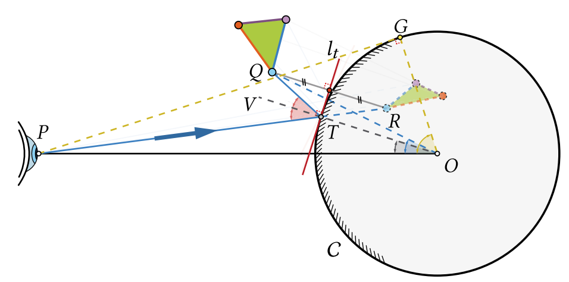
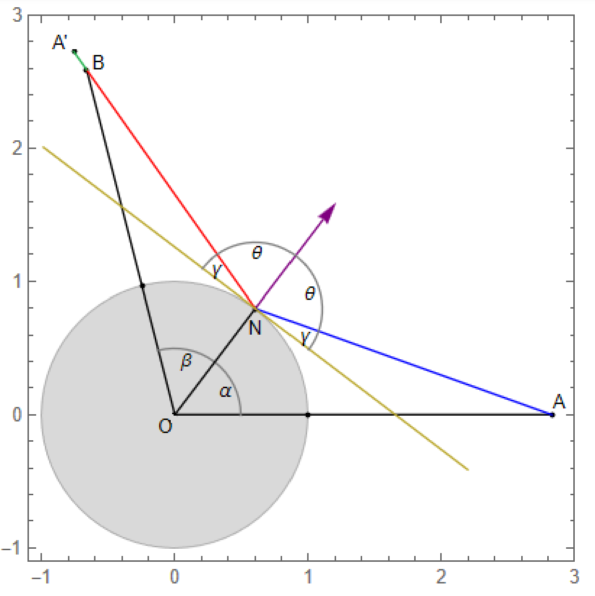
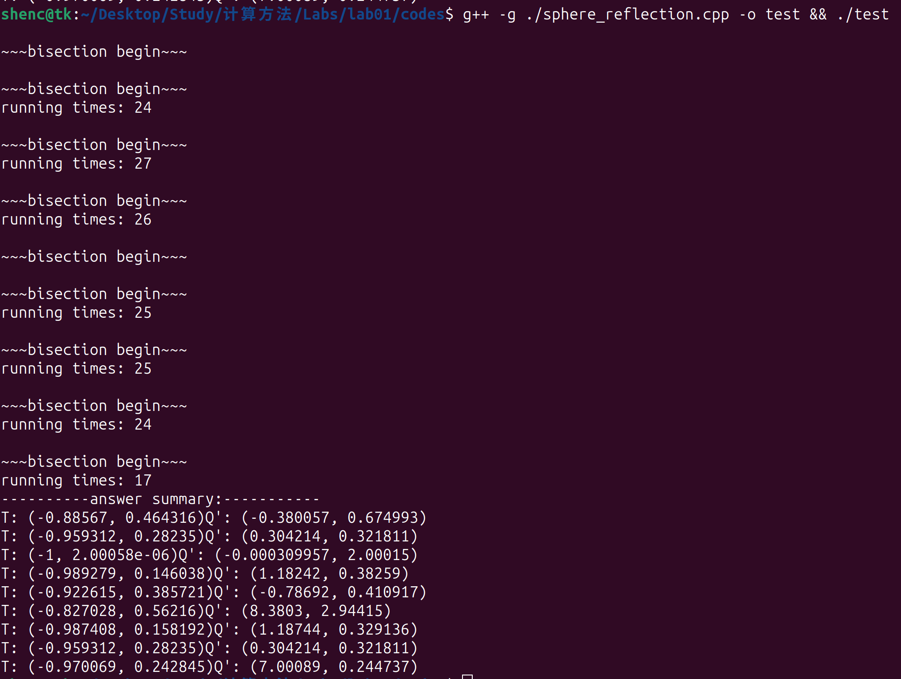
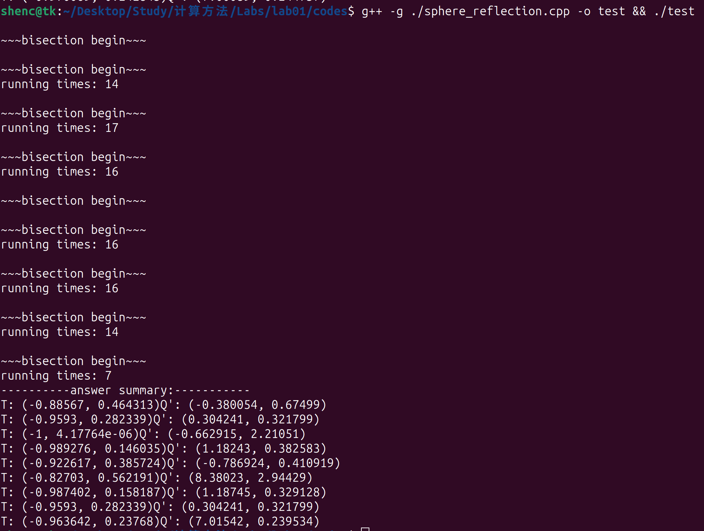
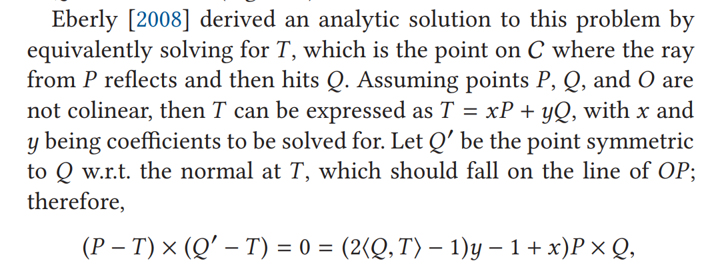

<div style='font-size: 3em; color: blue;' align='center'><b>Lab01_Report</b></div>


<div align='center'>申长硕 大数据学院 PB22020518</div>


<div style='font-size: 2em; color: purple;' align='center'><b>问题引入</b></div>

面对在平面中求解一个三角形从经过mirror cup反射到另一点的**反射路径**的求解问题，抽象出点的反射问题。



经提供参考材料得到如下解决方案：

<div style='font-size: 2em; color: purple;' align='center'><b>数学分析</b></div>

#### 解析解(derived by Eberly)



从A出射的光线经过C面反射到B点，设A，B，O不共线，可以用N及其垂线两方向上的单位向量表示A和A'：
$$
\begin{align}
A &= sN + tN^{\perp}\\
A' &= sN - tN^{\perp}
\end{align}
$$
可以将A'表示为：
$$
A' = 2<N, A>N - A
$$
前提A，B不共线，则可以将N表示为A，B的线性组合：
$$
N = xA + yB
$$
于是我们有：
$$
\begin{align}
A \times N &= A \times (xA + yB) = 0 + yA \times B = yA \times B \\
N \times B &= xA \times B\\
N \cdot A &= xA \cdot A + y B \cdot B
\end{align}
$$
同时，由于N模长为1,于是有：
$$
1 = N \cdot N = x^2 A \cdot A + 2xy A \cdot B + y^2 B \cdot B \tag{1}
$$
N需要满足向量(B - N)和(A' - N)共线，有：
$$
\begin{align}
0 &= (B - N) \times (A' - N)\\
  &= (B - N) \times[(2N \cdot A - 1)N - A]\\
  &= (2N \cdot A - 1)B \times N - B \times A + N \times A\\
  &= (2N \cdot A - 1)B \times (xA + yB) - B \times A + (xA + yB) \times A\\
  &= [(2N \cdot A - 1)x - 1 + y]B \times A\\
  &= [(2xA \cdot A + 2yA \cdot B - 1)x - 1 + y]B \times A 

\end{align}
$$
其中 $B \times A \neq 0$，于是我们有：
$$
(2xA \cdot A + 2yA \cdot B - 1)x - 1 + y = 0 \tag{2}
$$
由(1)，(2)两式，我们可以得到关于x，y两未知数的方程组：
$$
\begin{align}
p(x, y) &= ux^2 + 2vxy + wy^y - 1 = 0\\
q(x, y) &= 2ux^2 + 2vxy - x + y - 1 = 0

\end{align}
$$
通过p(x, y) = 0用x表示y：
$$
y = {{1 + x - 2ux^2}\over{1 + 2vx}} \tag{3}
$$
将其带入p(x, y) = 0，得到：
$$
{{4u(uw- v^2)x^4 + 4(v^2 - uw)x^3 + (u + 2v + w - 4uw)x^2 + 2(w - v)x + (w - 1)} \over{(1 + 2vx)^2}} = 0
$$
其中$u = A \cdot A, v = A \cdot B, w = B \cdot B$

分母不为0,于是可以得到方程：
$$
r(x) = 4u(uw - v^2)x^4 + 4(v^2 - uw)x^3 + (u + 2v + w - 4uw)x^2 + 2(w - v)x + (w - 1) = 0 \tag{4}
$$
其中：
$$
uw - v^2 = (A \cdot A)(B \cdot B) - (A \cdot B)^2 = |A \times B|^2 \neq 0
$$
所以这是一个四次方程，之后就可以通过(4)解出实根$\overline x$并带入(3)求出对应$\overline y$


<div style='font-size: 2em; color: purple;' align='center'><b>算法设计</b></div>

#### 问题描述：

* 假设：

  > 原点处有一镜面单位圆C，可以反射光线
  >
  > 观察点P位于x轴负半轴且在圆外
  >
  > 物点在第二象限且在圆外

* 输入：

  > 观察点P，$P \in \{ (x, y) | x \lt -1, y = 0 \}$
  >
  > 物点Q，$Q \in \{ (x, y) | x \lt 0, y \gt 0, x^2 + y^2 > 1 \}$

* 输出：

  > 反射点T的位置$(x_t, y_t)$
  >
  > 像点Q的位置$(x_q, y_q)$

#### 基本思想：使用牛顿二分法，对上述方程求解

P，Q不共线，于是可以用P，Q两点表达出反射点T：
$$
T = \alpha P + \beta Q
$$
将输入的P，Q两点带入上述分析中可以定义出：
$$
\begin{cases}
\begin{align}
u &= P \cdot P = x_p^2\\
v &= P \cdot Q = x_p \cdot x_q\\
w &= Q \cdot Q = x_q^2 + y_q^2
\end{align}
\end{cases}
$$
于是该问题转化为解决四次方程($\alpha即为其中的x$)：
$$
{4u(uw- v^2) x^4 + 4(v^2 - uw)x^3 + (u + 2v + w - 4uw)x^2 + 2(w - u)x + (w - 1)} = 0
$$
解出$\alpha$之后带入方程：
$$
\beta = {{1 + \alpha - 2u\alpha^2}\over{1 + 2v \alpha}}
$$
即可解出$\beta$，后可以将T表示出来：
$$
\begin{cases}
x_t = \alpha x_p + \beta x_q\\
y_t = \beta y_q

\end{cases}
$$
#### 求解Q对称点Q'的两种方案：

1. 根据对称关系：
   $$
   \begin{cases}
   \begin{align}
   Q &= sT^{\perp} + tT\\
   Q' &= sT^{\perp} - tT
   \end{align}
   \end{cases}
   $$
   通过求解$\vec{TQ}$和$\vec{T}$以及$\vec{T^{\perp}}$的内积确定系数s和t
   $$
   \begin{cases}
   \begin{align}
   t &= \vec{TQ} \cdot \vec{OT}\\
   s &= \vec{TQ} \cdot \vec{T^{\perp}}
   \end{align}
   \end{cases}
   $$
   回带解出Q'即可

2. 根据P，T，Q共线以及$|QT| = |Q'T|$求解出Q'位置
   $$
   \vec{TQ'} = \lambda \vec{PT}\\
   |\vec{TQ'}| = |\vec{TQ}|\\
   =>\vec{TQ'} = {|\vec{TQ}| \over |\vec{PT}|} \vec{PT}\\
   =>Q' = T + {|\vec{TQ}| \over |\vec{PT}|} \vec{PT}
   $$
   将其带入即可，本作业采用第二种方法(第一种方法我想的需要两次平移，不如第二种来的直接)


<div style='font-size: 2em; color: purple;' align='center'><b>代码设计</b></div>

#### 此处本人取实验主要部分的子函数代码进行描述，其余代码部分见*./src/sphere_reflection..cpp*，原理部分见前面`数学分析` `算法设计`板块

1. 主函数流程

   主要实现：

   1. 文件的读取，文件中每行为3个数值，分别表示$x_p, x_q, y_q$将其存储在一个二维vector中，由于这个过程二维数组也可以实现，所以并未通过调库获利
   2. 通过输入计算前面数学分析部分定义出的u, v, w，即三个内积，将其带入上述推导的公式得到需求的四次函数的各项系数
   3. 调用二分法求解函数零点，进而得到使用$\vec{P}, \vec{Q}$表示T点的P系数
   4. 进而求解Q的系数
   5. 通过算法设计给出的第二种方法求解Q的像点Q'

   ```cpp
   int main()
   {
       // 不通过主函数传参，打开input.txt文件传入一系列x_p, x_q, y_q
       std::ifstream file("./input.txt");
       std::vector<std::vector<double>> data;
       std::vector<std::vector<double>> ans;
   
       if(file.is_open())
       {
           std::string line;
           while(std::getline(file, line))
           {
               // 逐行读取嘛
               std::vector<double> row;
               std::stringstream ss(line);
               double value;
   
               for(int i = 0; i < 3; i++)
               {
                   if(ss >> value)
                   {
                       row.push_back(value);
                       // std::cout << value << "\t";
                   }
                   else{
                       std::cerr << "Expected 3 numbers for each line" << std::endl;
                       return 1;
                   }
               }
               data.push_back(row);
           }
       }
       else
       {
           std::cerr << "Unable to open the file" << std::endl;
           return 1;
       }
       // 现在我们已经将数据存入<vector> data,
       // 输出检查一番
       for(const auto& row: data)
       {
           for(const auto& value : row)
           {
               std::cout << value <<"\t";
           }
           std::cout << std::endl;
           // 先计算u, v, w
           double* uvw = calc_uvw(row[0], row[1], row[2]);
   
           // 之后计算该四次函数的系数：
           double* coe = coefficient(uvw);
   
           // 计算coefficients之后使用二分法计算方程的根
   
           // 从0, |1 / x_p|开始迭代，因为x_t在-1～0之间，其余无意义
           double alpha = bisection(0, -1.0 / row[0], 1e-8, coe);
   
           // 这里简单尝试一下牛顿法
           // double alpha = newton(-1.0 / row[0], 1e-10, coe);
   
   
           // 之后用alpha带入公式计算beta
           double beta = calc_beta(alpha, uvw);
   
           double x_t = alpha * row[0] + beta * row[1];
           double y_t = beta * row[2];
   
           // 这里计算Q',q_reflected
           double* q_r = calc_reflection(x_t, y_t, row[0], row[1], row[2]); 
           
           std::vector single_ans = {x_t, y_t, q_r[0], q_r[1]};
           ans.push_back(single_ans);
           std::cout << "(" << x_t << ", " << y_t << ")"<< std::endl;
           // 简单进行一个内存的释放
           delete[] uvw;
           delete[] coe;
           delete[] q_r;
       }
   
       // 输出检查
       std::cout<<"----------answer summary:-----------"<<std::endl;
       for(const auto& single_ans : ans)
       {
           std::cout<<"T: ("<<single_ans[0] <<", "<<single_ans[1]<<")"<<"Q': ("<<single_ans[2]<<", "<<single_ans[3]<<")"<<std::endl;
       }
       return 0;
   
   }
   ```

2. 二分法实现

   1. 逻辑相对简单，多做的一点就是定义了sgn函数来判断函数值同号异号，防止迭代后期因为函数值过小其乘积无法计算而得0的“风险”
   2. 

   ```cpp
   int sgn(double x)
   {
       if(x >= 0){
           return 1;
       }
       else{
           return -1;
       }
   }
   
   // 二分法
   double bisection(double left, double right, double epsilon, double coe[5])
   {
       std::cout<<std::endl<<std::endl<<"二分开始执行"<<std::endl;
       // std::cout<<"coe数组"<<std::endl;
       // for(int i = 0; i < 5; i++)
       // {
       //     std::cout<<coe[i]<<std::endl;
       // }
       double mid;
       int run_times = 0;
       while(fabs(right - left) > epsilon)
       {
           mid = (left + right) / 2.0;
           double fun_value = func(mid, coe);
           // std::cout<<"value this loop"<<"\t mid:"<<mid<<"func_value"<<fun_value<<std::endl;
           // std::cout<<"f(left)"<<func(left, coe)<<std::endl;
           // std::cout<<"f(right)"<<func(right, coe)<<std::endl;
           if(fabs(fun_value) < epsilon)
           {
               return mid;
           }
           else if(sgn(fun_value) * sgn(func(left, coe)) < 0)
           {
               right = mid;
           }
           else
           {
               left = mid;
           }
           run_times++;
       }
       std::cout<<"运行次数"<<run_times<<std::endl;
       return (left + right) / 2.0;
   }
   ```

3. 像点Q'的确定

   1. 通过上述算法设计2得到的公式直接带入计算即可

   ```cpp
   double* calc_reflection(double x_t, double y_t, double x_p, double x_q, double y_q)
   {
       // lambda = |TQ| / |PT|
       double lambda = std::pow(((x_t - x_q) * (x_t - x_q) + (y_t - y_q) * (y_t - y_q)), 0.5) / std::pow(((x_t - x_p) * (x_t - x_p) + y_t * y_t), 0.5);
       // std::cout<<"lambda:"<<lambda<<std::endl;
   
       double x_qr = x_t + lambda * (x_t - x_p);
       double y_qr = y_t + lambda * y_t;   // y_p = 0
   
       double* coordinates = new double[2];
       coordinates[0] = x_qr;
       coordinates[1] = y_qr;
   
       std::cout<<"Q': ("<<x_qr<<", "<<y_qr<<")"<<std::endl;
   
       return coordinates;
   }
   ```

<div style='font-size: 2em; color: purple;' align='center'><b>实验结果</b></div>

#### 通过上述代码，所得结果：

| P              | Q         | T                     | Q'                      |
| -------------- | --------- | --------------------- | ----------------------- |
| (-2, 0)        | (-1, 1)   | (-0.88567, 0.464316)  | (-0.380057, 0.674993)   |
| (-10, 0)       | (-2, 1)   | (-0.959312, 0.28235)  | (0.304214, 0.321811)    |
| (-1.000001, 0) | (-2,2)    | (-1, 2.00058e-06)     | (-0.000309957, 2.00015) |
| (-2.33, 0)     | (-3, 1)   | (-0.989279, 0.146038) | (1.18242, 0.38259)      |
| (-3, 0)        | (-1, 0.5) | (-0.922615, 0.385721) | (-0.78692, 0.410917)    |
| (-3, 0)        | (-2, 10)  | (-0.827028, 0.56216)  | (8.3803, 2.94415)       |
| (-3, 0)        | (-3, 1)   | (-0.987408, 0.158192) | (1.18744, 0.329136)     |
| (-10, 0)       | (-2, 1)   | (-0.959312, 0.28235)  | (0.304214, 0.321811)    |
| (-1024, 0)     | (-8, 4)   | (-0.970069, 0.242845) | (7.00089, 0.244737)     |

#### 执行结果截图：

执行：

```
g++ -g ./sphere_reflection.cpp -o test && ./test
```

结果：




<div style='font-size: 2em; color: purple;' align='center'><b>分析与思考</b></div>

1. 代码执行过程中记录了二分法的执行次数(epsilon设置为1e-8)，执行25次左右，而将其改为1e-5后执行15次左右，结论就是在后期收敛速度不是那么快

   

2. 编写代码过程中，遇到了一个比较大的问题：

   1. 对于第二个输入，最后的输出结果T竟然算到了**第一象限**
   2. **分析原因**：求根的四次多项式，如果二分的起始位置是0和1的话最终可能无法收敛到想要的零点
   3. **相关改进**：二分的起点换成(0, $|{1 \over x_p}|$)，即进一步控制T点可能的取值范围，其中还有一些问题，就是Q点的横坐标对T点的确定也会有影响，不过这里就不予考虑了
   4. **改进的原理**：T点不仅是P, Q两点的反射点，同时也是整个圆上第二象限所有点距离P,Q之和最小的点，所以将$x_t$控制在[-1, 0]之间的话就会收敛到T点

3. 稳健性问题：该算法推导依赖P，T，Q不共线，对于TP, TQ两向量夹角过于小时可能会不稳定等

4. 在参考文献[1]中解析方法时发现两个错误：

   1. 
   2. 最后一句话**w.r.t the normal at T**应该是**tangent line(to the circle) at T**，应该是在T点出的切线而不是法线（或者此文中切线法线定义与我熟知的不同）
   3. 下面的公式右边缺少一个括号，应该是$[(2 \cdot A - 1)x - 1 + y]B \times A$(A,B,N即上面Q,P,T)

<div style='font-size: 2em; color: purple;' align='center'><b>参考文献</b></div>

​	*[1] Computational Mirror Cup and Saucer Art KANG WU, RENJIE CHEN, XIAO-MING FU, and LIGANG LIU, University of Science and Technology of China, China*

​	*[2] Alhazen’s Problem: Reflection Point on a Sphere David Eberly, Geometric Tools, Redmond WA 98052*

