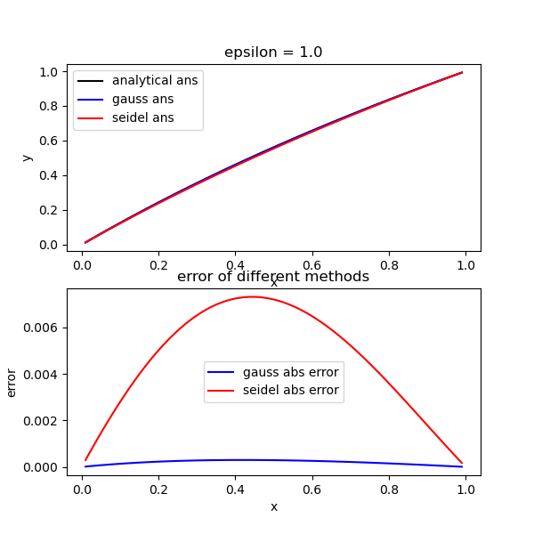
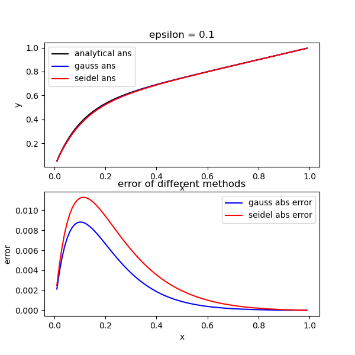
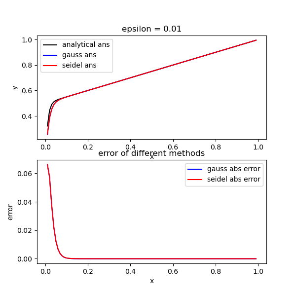
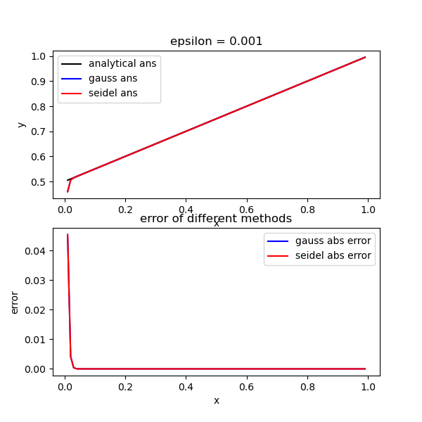

<div style='font-size: 3em; color: blue;' align='center'><b>Lab02_Report</b></div>


<div align='center'>申长硕 大数据学院 PB22020518</div>


<div style='font-size: 2em; color: purple;' align='center'><b>问题引入</b></div>

使用计算机做数值计算时需要将连续问题离散化。

例如：对于一个求解两点边值的微分方程，计算机在做计算时需要将其转换为差分方程，从而实现离散化，并通过取合适的步长达到相对可观的精度。

转换为差分方程之后，进一步将其转换为求解线性方程组，具体间`数学分析`部分。

实验目的：

* 通过使用C/Cpp语言实现两种线性方程组求解的算法：

	* 列主元Gauss消元

	* Gauss-Seidel迭代法

	同时比较两种算法的表现

<div style='font-size: 2em; color: purple;' align='center'><b>数学分析</b></div>

#### 对于一个两点边值问题：

$$
\begin{cases}
\epsilon {d^2 y \over dx^2} + {dy \over dx} = a, a \in (0, 1) \tag{1.1}\\
y(0) = 0, y(1) = 1
\end{cases}
$$
1. 可以求得解析解为：

$$
y = {{1 - a} \over 1 - e^{-{1 \over \epsilon}}}(1 - e^{-{x \over \epsilon}}) + ax \tag{1.2}
$$
2. 而实际上计算机求解需要通过将一个连续的方程离散化进行求解，例如：将[0 1]区间n等分，另$h = {1 \over n}$ ，有：

$$
x_i = ih, i =  1, 2, 3, ..., n-1
$$
3. 从而将一个微分方程转换为一个步长较小的差分方程：

$$
\epsilon {y_{i - 1} - 2y_i - y_{i+1} \over h^2} + {y_{i + 1} - y_i \over h} = a \tag{1.3}
$$
4. 可以简化为：

$$
(\epsilon + h) y_{i + 1} - (2 \epsilon + h)y_i + \epsilon y_{i - 1} = ah^2 \tag{1.4}
$$

5. 从而离散后得到的线性方程组为：
   $$
   \begin{cases}
   {(\epsilon + h) y_n} - (2 \epsilon + h)y_{n - 1} + \epsilon y_{n - 2} &= ah^2\\
   (\epsilon + h) y_{n - 1} - (2 \epsilon + h)y_{n - 2} + \epsilon y_{n - 3} &= ah^2\\
   ...\\
   ...\\
   ...\\
   (\epsilon + h) y_3 - (2 \epsilon + h)y_2 + \epsilon y_1 &= ah^2\\
   (\epsilon + h) y_2 - (2 \epsilon + h)y_1 + \epsilon y_0 &= ah^2\\
   y_0 = 0, y_n = 1
   \end{cases} \tag{1.5.1}
   $$


6. 将常数$y_n即y(1)$和$y_0即y(0)$移到方程右边：
   $$
   \begin{pmatrix}
   -(2 \epsilon + h) & \epsilon + h & & &\\
   \epsilon & -(2\epsilon + h) & \epsilon + h & &  \\
    & \epsilon & -(2\epsilon + h) & . & \\
     & & . & . & \epsilon + h\\
     & & & \epsilon & -(2\epsilon + h)
   \end{pmatrix}
   \begin{pmatrix}
   y_1\\
   y_2\\
   y_3\\
   .\\
   .\\
   y_{n-1}
   \end{pmatrix}
    = 
   \begin{pmatrix}
   ah^2\\
   ah^2\\
   ah^2\\
   .\\
   .\\
   ah^2 - (\epsilon + h)
   
   \end{pmatrix}
   
   \tag{1.5.2}
   $$
   
7. 系数矩阵为：

$$
A = \begin{pmatrix}
-(2 \epsilon + h) & \epsilon + h & & &\\
\epsilon & -(2\epsilon + h) & \epsilon + h & &  \\
 & \epsilon & -(2\epsilon + h) & . & \\
  & & . & . & \epsilon + h\\
  & & & \epsilon & -(2\epsilon + h)
\end{pmatrix}_{n-1 * n-1} \tag{1.6.1}
$$

8. 增广矩阵为：
   $$
   \begin{pmatrix}
   -(2 \epsilon + h) & \epsilon + h & & & & ah^2 - \epsilon * 0\\
   \epsilon & -(2\epsilon + h) & \epsilon + h & & & ah^2 \\
    & \epsilon & -(2\epsilon + h) & . & & .\\
     & & . & . & \epsilon + h & ah^2\\
     & & & \epsilon & -(2\epsilon + h) & ah^2 - (\epsilon + h)*1
   \end{pmatrix} \tag{1.6.2}
   $$

* 对于$\epsilon = 1, a = {1 \over 2}, n = 100$：
  * 分别用列主元Gauss消元法，Gauss-Seidel迭代法求解线性方程组的解*
  * Gauss-Seidel消元要求有4位有效数字
  * 还需比较与精确解的误差
* 对于$\epsilon =  0.1, \epsilon = 0.01, \epsilon = 0.0001$考虑相同的问题

#### Gauss列主元消元

对于一个线性方程组：
$$
Ax = b \tag{2.1}
$$
我们首先写出其增广矩阵
$$
\begin{pmatrix}
a_{11} & a_{12} & a_{13} & ... & a_{1n} & | & b_1\\
a_{21} & a_{22} & a_{23} & ... & a_{2n} & | & b_2\\
.&&&&&|&.\\
.&&&&&|&.\\
.&&&&&|&.\\
a_{n1} & a_{n2} & a_{n3} & ... & a_{nn} & | & b_n

\end{pmatrix} \tag{2.2}
$$

1. 将增广矩阵化成上三角的形式，方便后续进行回代求解

   * 基本化简方法：
     $$
     \vec{row_j} = \vec{row_j} - {a_{ji} \over a_{ii}} \cdot \vec{row_i} \tag{2.3}
     $$

   * 同时，为了防止计算时因为主对角线元素过于小作分母可能会导致较大的`舍入误差`，所以在每一次化简之前加入`主元`技巧，将一列中按模最大的元素所在行与主对角线元素所在行进行互换(注意多开一个数组专门用于记录交换顺序)，之后再执行正常的消元过程

2. 回代求解

   * 当得到上三角形式的矩阵之后，就可以从最后一行进行回代求解

     对于最后一行，直接解除最后一个变量

     对于倒数第二行，将最后一行解出的值进行带入进行求解

     以此类推

   * **注意，解出对应向量之后需要按照之前记录的换行顺序将对应位置的解调换回去**：这里是错的，我们对增广矩阵进行操作的时候，在交换A中两行的同时，b的一列中对应元素也已经交换了，所以对最终的解并没有影响，也就不需要事后更新顺序！！！

#### Gauss-Seidel Iterative Method

是一种用于求解线性方程组的迭代方法。它是高斯迭代法的一种改进版本，通过在每次迭代中使用已经计算出的最新近似解来加速收敛。

对于一个线性方程组：
$$
Ax=b \tag{3.1}
$$
其中 A 是系数矩阵，x 是未知向量，b 是已知向量。Gauss-Seidel 迭代法的基本思想是将线性方程组的每个方程按照迭代的顺序分别求解，然后**使用已经计算出的最新近似解来更新下一个方程**的计算。具体步骤如下：

1. 将A分解为下三角矩阵、对角阵、上三角矩阵之和：

$$
\begin{align}
let:& A = L + D + U \\
=>& (L + D + U)x = b \\
=>& (L + D) = -Ux + b \\
=>& x = -(D + L)^{-1} U x + (D+L)^{-1} b
\end{align} \tag{3.2}
$$

2. 从而构造迭代格式：
   $$
   x^{(k + 1)} = Mx^{(k)} + g...
   \begin{cases}
   M = -(D + L)^{-1}U\\
   g = (D + L)^{-1}b
   \end{cases} \tag{3.3}
   $$

3. 实际求解时，不求矩阵的逆而是求解：
   $$
   (D + L)x^{(k + 1)} = -Ux + b \tag{3.4}
   $$

4. 当然，在算法执行过程中本人采用的是分量形式：
   $$
   x_i^{(k + 1)} = \Sigma_{j = 1}^{i - 1}r_{ij}x_j^{(k + 1)} + \Sigma_{j = i + 1}^nr_{ij}x_j^{(k)} + g_i \tag{3.5} 	\\
   记r_{ij} = -{a_{ij} \over a_{ii}}, g_i = {b_i \over a_{ii}}, r_{ii} = 0
   $$

4. 重复执行上述迭代，直到$||x^{(k + 1)} - x^{(k)}|| \lt \epsilon$，其中$\epsilon$是某个预先设置好的阈值


<div style='font-size: 2em; color: purple;' align='center'><b>算法设计及代码实现</b></div>

#### 此部分主要阐述两种线性方程组求解方法的实现

**pre-claim:**

* 首先，在矩阵表示时使用std::vector，但是所用功能使用double型数组仍然可以实现，所以并未因为这个数据类型获利
* 其次，本实验笔者尝试实现差分法求解函数的可视化和绝对误差的可视化，可视化部分借助python中matplotlib.pyplot实现，通过一个data.txt实现数交互（标准输入输出流的显示内容太多）

**线性方程组方法实现**

1. Gauss消元法:

   基本步骤：

   1. 寻找系数矩阵右下角子方阵的第一列中按模最大的元素，将该元素所在的一行与子方阵的第一行所在行进行交换，此处b向量中对应元素也进行交换，所以不再需要另开数组记录交换的顺序
   2. 消元，用子方阵的第一行按照左上角的与元素与第一列各元素比例进行消元
   3. 重复上述操作，直至将左侧系数矩阵化简为上三角阵
   4. 回代，自下而上求解$x_i$，并将解出的$x_i$往上带逐步求出待求向量

   代码实现：

   ```cpp
   std::vector<double> gaussElimination(std::vector<std::vector<double>>& matrix)
   {
       /* 
           这里实现Gauss列主元消元法
           不需要记录顺序，计算完再换回来，这是我最开始的误区
       */ 
       int rows = matrix.size();
       int cols = matrix[0].size() - 1; // 最后一列为向量b
       // 化简为上三角形矩阵
       for (int i = 0; i < rows - 1; i++) {
           // 找到当前列绝对值最大的行，并将其交换至当前行
           int maxRow = i;
           double maxVal = std::fabs(matrix[i][i]);
           for (int k = i + 1; k < rows; ++k) {
               if (std::fabs(matrix[k][i]) > maxVal) {
                   maxVal = std::fabs(matrix[k][i]);
                   maxRow = k;
               }
           }
           // 将主元换到对角位置(若非对角元素)，同时将swap_rec中两对应位置元素互换
           if (maxRow != i) {
               std::swap(matrix[i], matrix[maxRow]);
           }
           // 消元
           for (int j = i + 1; j < rows; j++) {
               double factor = matrix[j][i] / matrix[i][i];
               for (int k = i; k < cols + 1; k++) {
                   matrix[j][k] -= factor * matrix[i][k];
               }
           }
       }
       // 回代
       std::vector<double> solution(rows);
       for (int i = rows - 1; i >= 0; i--) {
           solution[i] = matrix[i][cols];
           for (int j = i + 1; j < cols; j++) {
               solution[i] -= matrix[i][j] * solution[j];
           }
           solution[i] /= matrix[i][i];
       }
       return solution;
   }
   ```

2. Gauss-Seidel迭代法：

   基本步骤：

   1. 基于尽可能的使用更新过的分量求解待解分量的思想，每一次迭代的解决方式：

   2. $$
      x_i^{(k + 1)} = \Sigma_{j = 1}^{i - 1}r_{ij}x_j^{(k + 1)} + \Sigma_{j = i + 1}^nr_{ij}x_j^{(k)} + g_i 	\\
      记r_{ij} = -{a_{ij} \over a_{ii}}, g_i = {b_i \over a_{ii}}, r_{ii} = 0
      $$

   3. 迭代结束的条件：
      $$
      ||x^{(k + 1)} - x^{(k)}|| \lt \epsilon
      $$
      其中由于最终需要保留4位有效数字，所以$\epsilon$取到5e-5

   代码实现：

   ```cpp
   double norm(const std::vector<double>& x)
   {
       // 求解欧几里德范数
       double result = 0.0;
       for (double val : x)
       {
           result += val * val;
       }
       return sqrt(result);
   }
   // 这里实现Gauss-Seidel迭代法求解线性方程组
   std::vector<double> gaussSeidel(const std::vector<std::vector<double>>& A, const std::vector<double>& b, double epsilon, int maxIterations)
   {
       // A是一个方阵
       int n = A.size();
       std::vector<double> x(n, 0.0);
       std::vector<double> x_new(n, 0.0);
   
       for(int it = 0; it < maxIterations; it++)
       {
           for(int i = 0; i < n; i++)
           {
               double sigma = 0.0; // sigma用于存储暂时的计算结果
               for (int j = 0; j < i; j++) 
               {
                   sigma += A[i][j] * x_new[j];
               }
               for (int j = i+1; j < n; j++)
               {
                   sigma += A[i][j] * x[j];
               }
               x_new[i] = (b[i] - sigma) / A[i][i];
           }
   
           // 检查收敛条件啦
           std::vector<double> residual(n, 0.0);
           for(int i = 0; i < n; i++)
           {
               residual[i] = x_new[i] - x[i];
           }
           // 用2范数判断
           double error = norm(residual);
           if(error < epsilon)
           {
               std::cout<<"converged after"<< it + 1<<"iterations"<<std::endl;
               return x_new;
           }
           x = x_new;
       }
   
       // 制定迭代次数还没收敛到指定的精度，简单进行一个报错
       std::cerr << "Did not converge after " << maxIterations << " iterations." << std::endl;
       return x;
   }
   ```

**可视化输出**

将解析解和两种方法求解出来的方法，以及两种方法和解析解之间的绝对误差保存在`data.txt`文件中，使用python进行可视化处理，并将图像保存为`visualization.png`中：

```python
import numpy as np
import matplotlib.pyplot as plt

def data_visualization():
    with open("./data.txt", "r") as file:
        lines = file.readlines()
        data = [line.strip().split(' ') for line in lines]
    data_array = np.array(data, dtype=float)

    # 打印结果
    print("Data as NumPy array:")
    print(data_array)

    fig, axes = plt.subplots(2, 1, figsize=(6, 6))
    
    axes[0].plot(data_array[:, 0], data_array[:, 1], color='black', label='analytical ans')
    axes[0].plot(data_array[:, 0], data_array[:, 2], color='blue', label='gauss ans')
    axes[0].plot(data_array[:, 0], data_array[:, 3], color='red', label='seidel ans')
    axes[0].set_xlabel('x')
    axes[0].set_ylabel('y')
    axes[0].set_title('ans from different methods')
    axes[0].legend()

    axes[1].plot(data_array[:, 0], data_array[:, 4], color='blue', label='gauss abs error')
    axes[1].plot(data_array[:, 0], data_array[:, 5], color='red', label='seidel abs error')
    axes[1].set_xlabel('x')
    axes[1].set_ylabel('error')
    axes[1].set_title('error of different methods')
    axes[1].legend()

    plt.savefig('visualization.png')
    plt.tight_layout()
    plt.show()
    
if __name__ == "__main__":
    data_visualization()
```

<div style='font-size: 2em; color: purple;' align='center'><b>分析与思考</b></div>

在pwd中执行如下命令，注意python环境中需要已经安装`numpy`，`matplotlib.pyplot`

```
g++ -g ./Gauss.cpp -o test && ./test
/home/shenc/anaconda3/bin/python /home/shenc/Desktop/Study/计算方法/Labs/lab02/visual.py
```

首先，对于$\epsilon = 1, \epsilon =  0.1, \epsilon = 0.01, \epsilon = 0.0001$分别进行讨论，其中$a = {1 \over 2}, n = 100$

1. $\epsilon = 1$:

   1. 从左到又分别是x，解析解，Gauss消元结果，Gauss-Seidel迭代结果，Gauss消元绝对误差，Gauss-Seidel迭代绝对误差，具体见`data.txt`

   2. **结果：**

      

      

#### 结果分析

通过最终函数图像的输出和两种方法的绝对误差：

1. 首先，Gauss消元法的求解相比Gauss-Seidel迭代法总是拥有较好的求解精度，不过笔者也尝试了将Gauss-Seidel迭代的epsilon减小，也可以获得和Gauss消元法相差不大甚至更好的求解精度

2. 其次，Gauss-Seidel的迭代法想要达到收敛条件在本实验中迭代进行的次数：

   | $\epsilon$ | 1.0  | 0.1  | 0.01 | 0.001 |
   | ---------- | ---- | ---- | ---- | ----- |
   | iterations | 4636 | 2302 | 300  | 127   |

   可以看到：当方程的解越不线性，所需迭代次数越多，所以效果较好的Seidel迭代对方程本身要求较高

3. 对于该微分方程，随着$\epsilon$的逐渐减小，函数图像愈发变得线性，因而相同步长的差分方程求解出的函数的拟合效果更好

4. 分析该微分方程结构可以的值：$\epsilon$越小，该微分方程的二阶项系数越小，方程$\epsilon {d^2 y \over dx^2} + {dy \over dx} = a$本身趋于一维微分方程${dy \over dx} = a$所以就越发线性，差分方程在其中的求解效果会愈发变好

#### 反思

1. 首先，对于增广矩阵进行Gauss消元不需要记录换行，只有在对一个系数矩阵进行分解的时候可能需要进行记录，或者是先分解后求解的时候需要记录，这是本人在完成本实验之前的一个误区。
2. 其次，在刚开始构造增广矩阵时，因为搞反了角标顺序，导致最开始求解时一直出现负数，最后是通过手算n=4的时候的矩阵情况才将该问题解决，下次要先用一个简单情况确定好顺序再上手编写程序。

