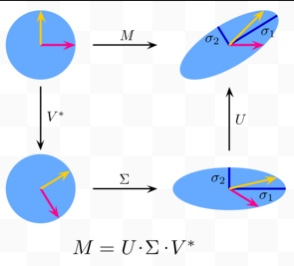
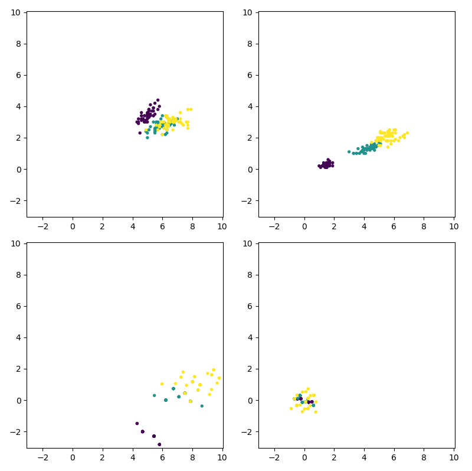

<div style='font-size: 3em; color: blue;' align='center'><b>Lab04_Report</b></div>


<div align='center'>申长硕 大数据学院 PB22020518</div>


<div style='font-size: 2em; color: purple;' align='center'><b>问题引入</b></div>


##### 本次实验实现Jacobi方法求解对称矩阵特征值，应用Jacobi方法实现PCA（主成分分析），并进一步实现矩阵的SVD分解（奇异值分解），具体步骤见后续`数学分析`部分


<div style='font-size: 2em; color: purple;' align='center'><b>数学分析</b></div>

#### PCA(Principal component analysis)

1. **目标**：在保留尽可能多信息的同时，对数据进行有效压缩->使用PCA降维方法
2. **数据表示**：将数据抽象成m个n维数据向量，可以span一个欧氏空间
   1. 一个n维欧氏空间只需要n个不线性相关的vector表出
   2. 一种压缩数据的思路是对这组向量进行降维，将向量投影到纬度更低的子空间上
   3. 问题：如何有效选择子空间
3. **协方差矩阵**：使用**协方差矩阵**刻画数据的分散程度
   1. 将m个n维数据向量去中心化($\vec{x} = \vec{x_o} - \vec{\mu}$)后按列构成n*m的矩阵X，协方差矩阵${1\over m}XX^T$
4. **特征值分解**：对协方差矩阵进行特征值分解，将特征向量所在的正交方向称作主方向
   1. 对应特征值越大，意味着在这一主方向包含的信息越多
5. **主成分选择**：
   1. PCA降维就是将协方差矩阵${1 \over m}XX^T$特征值DESC排序，提取前k个特征值对应特征个向量为前k个主方向，最终实现降维
4. **数据投影**：使用PCA可视化展示一组高维数据的分布，选取前两个主方向作为视觉平面，将数据投影在这一平面上实现高维数据的可视化
   1. 将去中心化的数据向量按列排成$n \times m$矩阵X
   2. 计算协方差矩阵${1\over m} XX^T$
   3. 应用Jacobi方法求解所有特征值
   4. 提取最大的两个特征值，计算其对应的单位特征向量作为视觉平面$e_1, e_2$计算这组数据的投影$x_i = <x, e_i>$，可视化展示结果

#### SVD(Singular Value Decomposition)

1. **目的**：通过奇异值分解，对任意矩阵进行分解。

1. PCA是对${1 \over m} XX^T$求解从而对行向量做主成分分析，而对${1 \over n} X^TX$的特征值和特征向量则可以对列向量进行PCA

2. 将${1\over m}XX^T$各个特征向量按列组成的矩阵记为U，将${1 \over n}X^TX$特征向量组成的矩阵记为V，通过UV阵可以对X做分解：$X = U \Sigma V^T$，其中$\Sigma$为$n \times m$对角阵，对角元是$X^TX$特征值的平方根

3. 对于任意的矩阵A都可以做上述分解称为SVD分解，且有：
   $$
   AA^T = U \Sigma V^T V \Sigma U^T = U \Sigma^2U^T\\
   A^TA = V \Sigma U^TU\Sigma V^T = V \Sigma^2V^T
   $$

   1. 对称矩阵的SVD：对称矩阵$A$的SVD分解是它本身的特征值分解。首先计算$A$的特征值和特征向量，构建矩阵$U$。然后构建矩阵$V$，使得$A^T A = V \Sigma^2 V^T$，其中$\Sigma$是特征值的对角矩阵。最终得到$A = U \Sigma V^T$。
   2. 一般矩阵的SVD：对于任意矩阵$A$，通过对$AA^T$和$A^TA$进行特征值分解得到$U$和$V$，然后构建奇异值矩阵$\Sigma$。最终得到$A = U \Sigma V^T$。
   
4. 具体步骤:

   1. Jacobi求解$AA^T$的特征值
   2. 计算$AA^T$各个特征值对应的单位特征向量组成矩阵U
   3. 计算$A^TA$各个特征值对应的单位特征向量组成矩阵V
   4. 计算$\Sigma = diag(\sqrt{\lambda_1}, \sqrt{\lambda_2},..., \sqrt{\lambda_n})$
   
6. **几何含义：两个旋转，一个伸缩变换：

#### Jacobi方法

假设有一个对称矩阵$A$，它的维度为$n \times n$，我们的目标是找到$A$的所有特征值$\lambda_i$和对应的特征向量$\mathbf{v}_i$。Jacobi方法的核心思想是通过一系列相似变换，逐步将矩阵对角化，直到达到收敛条件。

1. **相似变换：** 相似变换是指将矩阵$A$转化为一个相似的对角矩阵$D$，即$D = Q^T \cdot A \cdot Q$，其中$Q$是一个正交矩阵，满足$Q^T \cdot Q = I$，$I$是单位矩阵。

2. **Givens旋转变换：**Givens旋转变换是一种用于将矩阵对角化的方法，它通过一系列旋转矩阵的乘积来实现对称矩阵的对角化。每个Givens旋转矩阵可以消除矩阵中一个特定位置的非对角元素，从而逐步将矩阵对角化。

   Givens旋转矩阵的形式如下：

   $$
   G_{ij}(\theta) = \begin{pmatrix}
   1 & \cdots & 0 & \cdots & 0 & \cdots & 0 \\
   \vdots & \ddots & \vdots & & \vdots & & \vdots \\
   0 & \cdots & \cos(\theta) & \cdots & -\sin(\theta) & \cdots & 0 \\
   \vdots & & \vdots & \ddots & \vdots & & \vdots \\
   0 & \cdots & \sin(\theta) & \cdots & \cos(\theta) & \cdots & 0 \\
   \vdots & & \vdots & & \vdots & \ddots & \vdots \\
   0 & \cdots & 0 & \cdots & 0 & \cdots & 1 \\
   \end{pmatrix}
   $$

   其中$G_{ij}(\theta)$是一个$n \times n$的矩阵，用于将矩阵中第$i$行和第$j$行的元素消除。通过选择合适的旋转角度$\theta$，我们可以使得矩阵中指定位置的元素变为0。这样，通过一系列Givens旋转变换，我们可以逐步将对称矩阵对角化，从而得到其特征值和特征向量

3. **迭代过程：** 在Jacobi方法中，我们将不断地应用Jacobi旋转，直到达到收敛条件为止。收敛条件通常是当矩阵$A$的非对角元素的绝对值都小于某个预先设定的阈值时停止迭代。

4. **Jacobi方法的具体步骤**：

   1. 初始化：将矩阵$A$赋值给$A'$，并初始化一个单位正交矩阵$Q$，例如单位矩阵。

   2. 迭代过程：

      1. 遍历矩阵$A'$的所有非对角元素，选择一个最大的非对角元素$(i, j)$。
      2. 计算旋转角度$\theta$，使得$(i, j)$位置的元素变为0。
      3. 构造Jacobi旋转矩阵$G_{ij}(\theta)$。
      4. 更新矩阵$Q = Q \cdot G$，$A' = G^T \cdot A' \cdot G$。
      5. 最终，对角线上的元素即为矩阵$A$的特征值，而$Q$的列向量即为对应的特征向量。

      

   1. 收敛条件：当矩阵$A'$的非对角线元素的绝对值都小于预先设定的阈值时，停止迭代。

<div style='font-size: 2em; color: purple;' align='center'><b>算法设计及代码实现</b></div>

 本次实验主要实现两个class，分别是 `SymmetricMatrix` 和 `SingularValueDecomposition` 以及一些必要的子函数，以下简单列出子函数的定义和两个class分别的实现

#### 提前声明的结构和子函数：
```cpp
typedef std::vector<std::vector<double>> Matrix;
typedef std::vector<double> Vector;

Matrix matrixMultiplication(const Matrix& A, const Matrix& B);
Matrix transpose(const Matrix& A);
Matrix generateRandomMatrix(size_t rows, size_t cols);
void printMatrix(const Matrix& matrix);
void normalize_matrix(Matrix& matrix);
Matrix reshapeMatrix(const Matrix& input, size_t targetRows, size_t targetCols);
void testJacobi();
Matrix read_iris();
void write_data(const Matrix& input);
Matrix removeLastColumn(const Matrix& matrix);
void addLastColumn(Matrix& matrix1, const Matrix& matrix2);
bool isclose(const Matrix& A, const Matrix& B, double tolerance);
```
#### class SymemtricMatrix
```cpp

class SymmetricMatrix
{
// 对称矩阵类定义
private:
    Matrix matrix;
    Matrix rotationMatrix;
    size_t size;

public:
    // 构造函数
    SymmetricMatrix(Matrix A) : matrix(A), size(A.size()) {
        // 初始化旋转矩阵为单位矩阵，之后对matrix进行操作的时候对这个矩阵做行变换，记录总的旋转矩阵
        rotationMatrix = Matrix(size, Vector(size, 0));
        for (size_t i = 0; i < size; i++) 
        {
            rotationMatrix[i][i] = 1.0;
        }
    }

    double getSquareSumOfNonDiagonalElements() const 
    {
        double squareSum = 0.0;
        for (size_t i = 0; i < size; ++i) {
            for (size_t j = i + 1; j < size; ++j) { // Only iterate over the upper triangular part
                squareSum += 2 * matrix[i][j] * matrix[i][j];
            }
        }
        return squareSum;
    }

    // Jacobi 变换
    void JacobiTransform() 
    {
        while (true) 
        {
            size_t p = 0, q = 1;
            // 找到最大的非对角元素的下标p, q
            for (size_t i = 0; i < size; ++i) 
            {
                for (size_t j = i + 1; j < size; ++j) 
                {
                    if (std::abs(matrix[i][j]) > std::abs(matrix[p][q])) 
                    {
                        p = i;
                        q = j;
                    }
                }
            }

            // 如果最大的非对角元素小于精度阈值，则停止迭代
            std::cout<<"square sum of non-diagonal elems:\t"<<getSquareSumOfNonDiagonalElements()<<std::endl;
            if (std::abs(matrix[p][q]) < 1e-6) 
            {
                break;
            }

            // 计算旋转角度
            double theta;
            if (matrix[p][p] == matrix[q][q]) 
            {
                theta = M_PI / 4;
            } 
            else 
            {
                theta = 0.5 * std::atan(2 * matrix[p][q] / (matrix[q][q] - matrix[p][p]));
            }

            // 计算旋转矩阵的元素
            double c = std::cos(theta);
            double s = std::sin(theta);

            // 更新旋转矩阵的第p行和第q行，将前面计算得到的旋转变换作用到旋转矩阵上
            // A = JDJ^T上，最终的旋转矩阵就是J
            for (size_t i = 0; i < size; i++) 
            {
                double temp1 = rotationMatrix[p][i];
                double temp2 = rotationMatrix[q][i];
                rotationMatrix[p][i] = c * temp1 - s * temp2;
                rotationMatrix[q][i] = s * temp1 + c * temp2;
            }

            // 更新矩阵元素
            for (size_t i = 0; i < size; i++) 
            {
                if (i != p && i != q) 
                {
                    double aip = matrix[i][p];
                    double aiq = matrix[i][q];
                    matrix[i][p] = c * aip - s * aiq;
                    matrix[i][q] = s * aip + c * aiq;
                    matrix[p][i] = matrix[i][p];
                    matrix[q][i] = matrix[i][q];
                }
            }

            double app = matrix[p][p];
            double aqq = matrix[q][q];
            double apq = matrix[p][q];
            matrix[p][p] = c * c * app - 2 * s * c * apq + s * s * aqq;
            matrix[q][q] = s * s * app + 2 * s * c * apq + c * c * aqq;
            matrix[p][q] = 0; // 对称矩阵的非对元素变为0
            matrix[q][p] = 0;
        }
        // 循环结束之后，按照对角元素大小重排矩阵D使之DESC排列，此时需要同时做行列变换，同时对旋转矩阵做相同的行变换
         // 循环结束之后，按照对角元素大小重排矩阵D使之DESC排列
        for (size_t i = 0; i < size; i++) 
        {
            for (size_t j = i + 1; j < size; j++) 
            {
                if (matrix[i][i] < matrix[j][j]) 
                {
                    // 同时交换旋转矩阵的行和列
                    for (size_t k = 0; k < size; k++) 
                    {
                        std::swap(matrix[k][i], matrix[k][j]);
                    }
                    for (size_t k = 0; k < size; k++)
                    {
                        std::swap(matrix[i][k], matrix[j][k]);

                        std::swap(rotationMatrix[i][k], rotationMatrix[j][k]);
                    }
                }
            }
        }
        rotationMatrix = transpose(rotationMatrix);
    }

    Matrix getRotationMatrix()
    {
        return rotationMatrix;
    }

    Matrix getDiagram()
    {
        return matrix;
    }

    Matrix checkIt()
    {
        Matrix result = matrixMultiplication(matrixMultiplication(rotationMatrix, matrix), transpose(rotationMatrix));
        return result;
    }


    // 打印矩阵
    void printInformation() 
    {
        std::cout<<"transformed metrix:"<<std::endl;
        printMatrix(matrix);
        
        std::cout<<"Rotation Matrix:"<<std::endl;
        printMatrix(rotationMatrix);
        
        std::cout<<"check if sufficient"<<std::endl;
        Matrix output = checkIt();
        printMatrix(output);
    }
};
```
#### SingularValueDecomposition
```cpp

class SingularValueDecomposition
{
private:
    Matrix A; // 原始矩阵 A
    Matrix U;
    Matrix V;
    Matrix sigma;

public:
    SingularValueDecomposition(Matrix input_A): A(input_A) {}

    void computeSVD() 
    {
        // 记录A矩阵的行数和列数，便于后面调用
        size_t rows = A.size();
        size_t cols = A[0].size();

        // 在这里实现 SVD 分解的步骤
        // 可以直接使用成员变量 A 来访问原始矩阵

        // 1. 计算 A * A^T, A^T * A
        Matrix AAT = matrixMultiplication(A, transpose(A));
        Matrix ATA = matrixMultiplication(transpose(A), A);

        std::cout<<"A * A^T:"<<std::endl;
        printMatrix(AAT);
        std::cout<<"A^T * A:"<<std::endl;
        printMatrix(ATA);

        // 3. 对以上两个矩阵进行 Jacobi 变换，得到 U 和 V
        // 先创建两个对象
        SymmetricMatrix symAAT(AAT);
        SymmetricMatrix symATA(ATA);

        // 使用Jacobi计算U,V
        symAAT.JacobiTransform();
        symATA.JacobiTransform();

        U = symAAT.getRotationMatrix();
        V = symATA.getRotationMatrix();

        std::cout<<"for AAT:"<<std::endl;
        symAAT.printInformation();
        std::cout<<"for ATA:"<<std::endl;
        symATA.printInformation();

        // 4. 从对角化后的矩阵中提取奇异值，构建 sigma 矩阵
        Matrix tmp_sigma = symAAT.getDiagram();
        std::cout<<"tmp sigma:"<<std::endl;
        printMatrix(tmp_sigma);
        for(size_t i = 0; i < rows; i++)
        {   
            tmp_sigma[i][i] = std::sqrt(tmp_sigma[i][i]);
            for(size_t j = i+1; j < rows; j++)
            {
                tmp_sigma[i][j] = tmp_sigma[j][i] = 0;
            }
        }
        std::cout<<std::endl<<std::endl;
        printMatrix(tmp_sigma);
        sigma = reshapeMatrix(tmp_sigma, rows, cols);
        std::cout<<"sigma for SVD:"<<std::endl;
        printMatrix(sigma);
        
    }

    void checkIt()
    {
        std::cout<<"U:"<<std::endl;
        printMatrix(U);
        std::cout<<"V:"<<std::endl;
        printMatrix(V);
        std::cout<<"sigma:"<<std::endl;
        printMatrix(sigma);
        std::cout<<"U * sigma * V^T:"<<std::endl;
        Matrix USV = matrixMultiplication(matrixMultiplication(U, sigma), transpose(V));
        printMatrix(USV);
        std::cout<<"if the USV == A:\t"<<isclose(A, USV, 1e-5)<<std::endl;
    }

};
```
#### 主函数：
* 测试Jacobi迭代
* 随机生成一个矩阵进行SVD并进行验证
* 读取`iris.txt`中的数据进行PCA处理，将处理后的数据存储在`processed_data.txt`后续写python做可视化

```cpp
int main()
{
    std::cout << "~~~Lab 04 Executing~~~" << std::endl;
    testJacobi();

    std::cout<<"SVD:"<<std::endl<<std::endl;

    //生成随机矩阵
    Matrix A = generateRandomMatrix(4, 3);
    std::cout << "Original matrix:" << std::endl;
    printMatrix(A);
    SingularValueDecomposition SVD_A(A);
    SVD_A.computeSVD();
    SVD_A.checkIt();
    
    std::cout<<"~~~SVD over~~~"<<std::endl;


    Matrix original_data = read_iris();
    // std::cout<<"original data"<<std::endl;
    // printMatrix(original_data);
    Matrix processed_data = removeLastColumn(original_data);
    // normalize_matrix(processed_data);
    // std::cout<<"remove the last column & normalize it :"<<std::endl;
    // printMatrix(processed_data);
    Matrix DTD = matrixMultiplication(transpose(processed_data), processed_data);
    std::cout<<"DTD:"<<std::endl;
    printMatrix(DTD);
    
    SymmetricMatrix iris_pca(DTD);

    iris_pca.JacobiTransform();
    iris_pca.printInformation();
    Matrix rotate_M = iris_pca.getRotationMatrix();
    printMatrix(rotate_M);
    // printMatrix(matrixMultiplication(rotate_M, transpose(rotate_M))); // 检查旋转矩阵是否是单位正交阵
    Matrix diag = iris_pca.getDiagram();
    std::cout<<"Eign Matrix:"<<std::endl;
    printMatrix(rotate_M);
    std::cout<<"diagram:"<<std::endl;

    std::cout<<"transformed matrix"<<std::endl;
    Matrix transformed_matrix = matrixMultiplication(processed_data, rotate_M);
    // normalize_matrix(transformed_matrix);
    // printMatrix(transformed_matrix);
    addLastColumn(transformed_matrix, original_data);
    printMatrix(transformed_matrix);
    write_data(transformed_matrix);
    std::cout<<"~~~Ending~~~"<<std::endl;
    
    return 0;
}
```
#### 可视化输出：
```py
import numpy as np
import matplotlib.pyplot as plt


def read_file(file_name):
    with open(file_name, 'r') as file:
        lines = file.readlines()
    data = [[float(num) for num in line.replace(',', ' ').strip().split()] for line in lines]
    data_array = np.array(data)
    # print(data_array)
    return data_array

def set_axes_limits(ax_list):
    # 找到四个子图中 x 和 y 轴的范围的最大值和最小值
    x_min = min(ax.get_xlim()[0] for ax in ax_list)
    x_max = max(ax.get_xlim()[1] for ax in ax_list)
    y_min = min(ax.get_ylim()[0] for ax in ax_list)
    y_max = max(ax.get_ylim()[1] for ax in ax_list)
    min_ = min(x_min, y_min)
    max_ = max(x_max, y_max)
    # 设置所有子图的 x 和 y 轴范围
    for ax in ax_list:
        ax.set_xlim(min_, max_)
        ax.set_ylim(min_, max_)


if __name__ == '__main__':
    data = read_file('iris.txt')
    transformed_data = read_file('transformed_data.txt')
    # 提取最后一列作为颜色分类
    colors = data[:, -1]
    fig, axs = plt.subplots(2, 2, figsize=(8, 8))
    # 绘制散点图，并根据最后一列的值选择颜色
    axs[0, 0].scatter(data[:, 0], data[:, 1], c=colors, cmap=plt.cm.get_cmap('viridis', 3), s=8)
    axs[0, 1].scatter(data[:, 2], data[:, 3], c=colors, cmap=plt.cm.get_cmap('viridis', 3), s=8)
    axs[1, 0].scatter(transformed_data[:, 0], transformed_data[:, 1], c=colors, cmap=plt.cm.get_cmap('viridis', 3), s=8)
    axs[1, 1].scatter(transformed_data[:, 2], transformed_data[:, 3], c=colors, cmap=plt.cm.get_cmap('viridis', 3), s=8)
    # 获取所有的子图对象列表
    all_axes = fig.axes
    # 统一设置所有子图的 x 和 y 轴范围
    set_axes_limits(all_axes)
    plt.tight_layout()
    plt.show()
```

<div style='font-size: 2em; color: purple;' align='center'><b>分析与思考</b></div>

#### 结果输出

##### SVD结果输出：

```
~~~Lab 04 Executing~~~
~~~begin testing jacobi~~~
Original matrix:
0.407571                0.62533         0.131905
0.43619         0.774601                0.996541
0.0870369               0.121557                0.977692
0.820075                0.334563                0.197303
AA^T:
0.574551                0.793608                0.240449                0.569476
0.793608                1.78336         1.10643         0.813482
0.240449                1.10643         0.978233                0.304947
0.569476                0.813482                0.304947                0.823384
square sum of non-diagonal elems:       5.98175
square sum of non-diagonal elems:       3.53336
square sum of non-diagonal elems:       2.11791
square sum of non-diagonal elems:       0.334924
square sum of non-diagonal elems:       0.239483
square sum of non-diagonal elems:       0.0795349
square sum of non-diagonal elems:       0.0436959
square sum of non-diagonal elems:       0.0174329
square sum of non-diagonal elems:       0.00573933
square sum of non-diagonal elems:       0.00396981
square sum of non-diagonal elems:       0.00237702
square sum of non-diagonal elems:       0.000785647
square sum of non-diagonal elems:       1.66611e-05
square sum of non-diagonal elems:       5.20167e-06
square sum of non-diagonal elems:       1.20853e-08
square sum of non-diagonal elems:       6.54958e-10
square sum of non-diagonal elems:       1.92228e-10
square sum of non-diagonal elems:       2.46916e-14
Transformed matrix:
transformed metrix:
3.24602         -1.26136e-09            0               1.11087e-07
-1.26136e-09            0.751051                4.35763e-14             0
0               4.35763e-14             0.162455                -1.954e-09
1.11087e-07             0               -1.954e-09              3.78028e-15
Rotation Matrix:
0.339857                0.457668                0.510334                0.643891
0.734419                -0.13183                0.346451                -0.568526
0.445799                -0.644806               -0.358341               0.507031
0.382609                0.597818                -0.700801               -0.0714278
check if sufficient
0.574551                0.793608                0.240449                0.569476
0.793608                1.78336         1.10643         0.813482
0.240449                1.10643         0.978233                0.304947
0.569476                0.813482                0.304947                0.823384
SVD:

Original matrix:
0.407571                0.62533         0.131905
0.43619         0.774601                0.996541
0.0870369               0.121557                0.977692
0.820075                0.334563                0.197303
A * A^T:
0.574551                0.793608                0.240449                0.569476
0.793608                1.78336         1.10643         0.813482
0.240449                1.10643         0.978233                0.304947
0.569476                0.813482                0.304947                0.823384
A^T * A:
1.03647         0.877686                0.735341
0.877686                1.11775         1.03926
0.735341                1.03926         2.0053
square sum of non-diagonal elems:       5.98175
square sum of non-diagonal elems:       3.53336
square sum of non-diagonal elems:       2.11791
square sum of non-diagonal elems:       0.334924
square sum of non-diagonal elems:       0.239483
square sum of non-diagonal elems:       0.0795349
square sum of non-diagonal elems:       0.0436959
square sum of non-diagonal elems:       0.0174329
square sum of non-diagonal elems:       0.00573933
square sum of non-diagonal elems:       0.00396981
square sum of non-diagonal elems:       0.00237702
square sum of non-diagonal elems:       0.000785647
square sum of non-diagonal elems:       1.66611e-05
square sum of non-diagonal elems:       5.20167e-06
square sum of non-diagonal elems:       1.20853e-08
square sum of non-diagonal elems:       6.54958e-10
square sum of non-diagonal elems:       1.92228e-10
square sum of non-diagonal elems:       2.46916e-14
square sum of non-diagonal elems:       4.78225
square sum of non-diagonal elems:       2.62212
square sum of non-diagonal elems:       0.214128
square sum of non-diagonal elems:       0.0425965
square sum of non-diagonal elems:       0.0191926
square sum of non-diagonal elems:       2.37089e-05
square sum of non-diagonal elems:       3.65604e-08
square sum of non-diagonal elems:       1.24911e-12
for AAT:
transformed metrix:
3.24602         -1.26136e-09            0               1.11087e-07
-1.26136e-09            0.751051                4.35763e-14             0
0               4.35763e-14             0.162455                -1.954e-09
1.11087e-07             0               -1.954e-09              3.78028e-15
Rotation Matrix:
0.339857                0.457668                0.510334                0.643891
0.734419                -0.13183                0.346451                -0.568526
0.445799                -0.644806               -0.358341               0.507031
0.382609                0.597818                -0.700801               -0.0714278
check if sufficient
0.574551                0.793608                0.240449                0.569476
0.793608                1.78336         1.10643         0.813482
0.240449                1.10643         0.978233                0.304947
0.569476                0.813482                0.304947                0.823384
for ATA:
transformed metrix:
3.24602         7.90289e-07             0
7.90289e-07             0.751051                3.4651e-11
0               3.4651e-11              0.162455
Rotation Matrix:
0.450376                0.649829                -0.612277
0.534837                0.352751                0.767799
0.71492         -0.673267               -0.188682
check if sufficient
1.03647         0.877686                0.735341
0.877686                1.11775         1.03926
0.735341                1.03926         2.0053
tmp sigma:
3.24602         -1.26136e-09            0               1.11087e-07
-1.26136e-09            0.751051                4.35763e-14             0
0               4.35763e-14             0.162455                -1.954e-09
1.11087e-07             0               -1.954e-09              3.78028e-15


1.80167         0               0               0
0               0.866632                0               0
0               0               0.403057                0
0               0               0               6.1484e-08
sigma for SVD:
1.80167         0               0
0               0.866632                0
0               0               0.403057
0               0               0
U:
0.339857                0.457668                0.510334                0.643891
0.734419                -0.13183                0.346451                -0.568526
0.445799                -0.644806               -0.358341               0.507031
0.382609                0.597818                -0.700801               -0.0714278
V:
0.450376                0.649829                -0.612277
0.534837                0.352751                0.767799
0.71492         -0.673267               -0.188682
sigma:
1.80167         0               0
0               0.866632                0
0               0               0.403057
0               0               0
U * sigma * V^T:
0.407571                0.62533         0.131905
0.43619         0.774601                0.996542
0.0870366               0.121557                0.977692
0.820075                0.334563                0.197304
if the USV == A:        1
~~~SVD over~~~
```
##### 对处理后的数据做可视化，附处理前的数据，方便进行对比
注：主要是ax[1, 0]的图像，本人已经统一所有坐标架的lim，方便进行比较


#### 总结：
1. 本次实验应该是截至目前计算方法前几次实验中任务量最大的实验了，本人在实验完成过程中几度因为碰壁过多想要使用python写本次实验，还好最后一波三折也算是坚持下来(虽然可视化还是用python做的哈哈哈)
2. 本次实验应该是本人初次接触PCA和SVD，所以在准备过程中检索了一些相关推文和视频进行学习，这两个方法在本人之后的数据分析中用处很大，在这里提前学到也是非常幸运
3. 经过验证，Jacobi在我们目前的使用情形下还是收敛的，最终可以有一个还算不错的计算效果，最终返回Diagram的时候直接令非对角元为0对最终计算的影响也不大，而且实现下来也还算简单，经过标准输出流观察，迭代次数也不是很多，所以效果还不错
4. 最经较忙，所以本次实验做的可能略显粗糙，之后有时间的话会尝试再用QR方法做特征向量和特征值的求解，个人相对更加喜QR方法哈哈哈