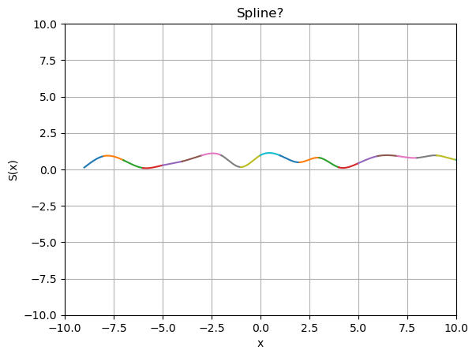
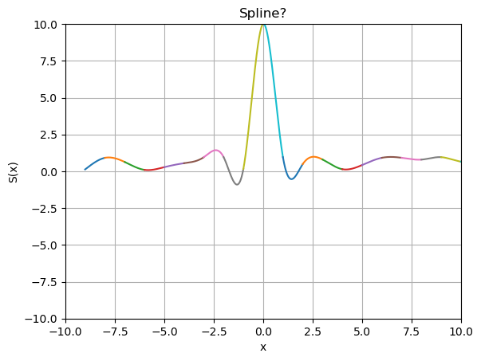
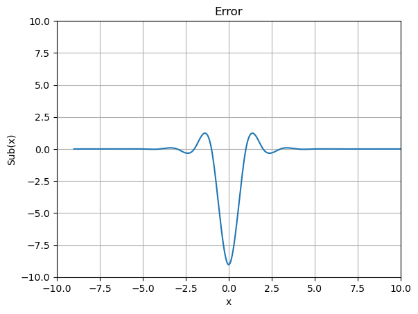
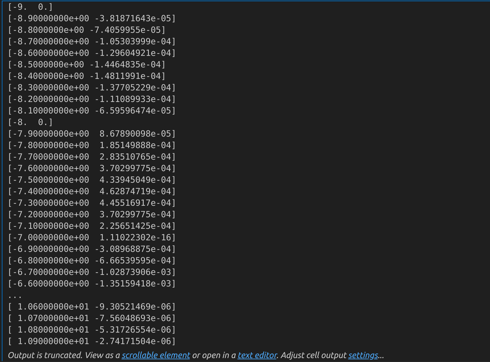

<div style='font-size: 3em; color: blue;' align='center'><b>Lab05_Report</b></div>


<div align='center'>申长硕 大数据学院 PB22020518</div>


<div style='font-size: 2em; color: purple;' align='center'><b>问题引入</b></div>

### 背景

数值分析中使用分段多项式定义一种叫做样条(spline)的函数，可以用来模拟如通过压铁固定弹性细木条的若干点所形成的一条光顺曲线

### 实验目的

实现三次样条插值算法，对于给定的若干插值节点，利用大M法计算三次样条插值函数

**注**：本次实验“面向过程”不是很多，为了便于后续可视化的实现，本次实验直接使用python(只使用matplotlib和numpy.array存储矩阵)，不借助其余module

<div style='font-size: 2em; color: purple;' align='center'><b>数理分析</b></div>

### 木条模型受力分析

对于弹性木条在集中载荷下的小变形模型，假设n+1个压铁(就是直到n+1个插值节点)，位置分别是$(x_0, y_0), (x_1, y_1), ...,(x_2, y_2)$木条曲线函数为$y(x)$，有Euler–Bernoulli beam theory:
$$
M(x) = EI ~ K(x) \tag{1}
$$
其中：

> $M(x)$为曲线弯矩
>
> $EI$为抗弯刚度
>
> $k(x)$为曲线曲率，小扰动下直接取二次微分，于是有

$$
k(x) = y''(x) = \frac{M(x)}{EI} \tag{2}
$$

考虑两个相邻的区间，假设A、B、C三点为三块压铁，将A、B看作支点，压铁C给木条一个

集中载荷力P，先由静力平衡：
$$
\begin{cases}
P_A l = P l_2\\
P_B l = P l_1 


\end{cases} \tag{3}
$$
相应的弯矩方程：
$$
M(x) = 
\begin{cases}
\frac{Pl_2}{l}x, 0 \le x \le l_1\\
P l_1 - \frac{Pl_1}{l}x, l_1 \le x \le l_2
\end{cases} \tag{4}
$$
M(x)是分段先行函数，根据式$(2)$可知在$A-B-C$区间内为分段三次函数，且具有$C^2$连续性(二阶导数连续)，所以使用三次样条函数

### 三次样条插值及大M算法

#### 三次样条插值引入

当已知某些点而不知道具体方程的时候，对于一些采样点，我们通常有两种做法：**拟合**或者**插值**

* 拟合不要求方程通过所有的已知点，讲究神似，就是整体趋势一致
* 插值则是形似，每个已知点都必会穿过，但是高阶会出现龙格现象，所以一般采用分段插值

三次样条就是说每个小区间的曲线是一个三次方程，三次样条方程满足以下条件：

1. 在每个分段小区间$[x_i, x_{i+1}]$上，$S(x) = S_i(x)$都是一个三次函数
2. 满足插值条件，即$S(x_i) = y_i$
3. 曲线光滑，即$S(x), S'(x), S''(x)$连续

 则这个三次方程可以构造成如下
$$
y = a_i + b_i x + c_ix^2 + d_ix^3
$$
形式的三次样条函数插值$S_i(x)$，对于每个区间都有$(a_i, b_i, c_i, d_i)$4个未知数，所以一共需要$4n$个方程

#### 大M法(二阶导数)

可用条件数共有：

> $n+1$个插值节点：
>
> 每个内点建立关系
>
> > $$
> > S(x_i + 0) = S(x_i - 0)\\
> > S'(x_i + 0) = S'(x_i - 0)\\
> > S''(x_i + 0) = S''(x_i - 0)
> > $$
> >
> > 有$3 * (n - 1)$个条件
>
> 还有边界约束：
>
> > 此处采用自然边界条件：端点处二阶导数为0

大M法：使用二阶导数表示样条插值函数

1. $S(x)$为三次多项式，相应的$S''(x)$为线性函数，做线性插值：
    $$
    S_i''(x) = \frac{x - x_{i+1}}{x_i - x_{x+1}}M_i + \frac{x - x_i}{x_{i+1} - x_i}M_{i+1}
    $$

2. 对$S''(x)$做两次积分，并记$h_i = x_{i+1} - x_i$，得：
    $$
    \begin{align}
    S(x) =S_i(x) &= \frac{{(x_{i+1} - x)^3}}{6 h_i}M_i + \frac{(x - x_i)^3}{6 h_i}M_{i+1} + cx + d\\
    &= \frac{{(x_{i+1} - x)^3}}{6 h_i}M_i + \frac{(x - x_i)^3}{6 h_i}M_{i+1} + C(x_{i+1} - x) + D(x - x_i)
    \end{align}
    $$

3. 将$S(x_i) = y_i, S(x_{i+1}) = y_{i+1}$代入得：
    $$
    \begin{cases}
    \frac{{(x_{i+1} - x_i)^3}}{6 h_i}M_i + C(x_{i+1} - x_i) = y_i\\
    \frac{(x_{i+1} - x_i)^3}{6 h_i}M_{i+1} + D(x_{i+1} - x_i) = y_{i+!}
    \end{cases}
    \rightarrow
    \begin{cases}
    C = \frac{y_i}{h_i} - \frac{h_i M_i}{6}\\
    D = \frac{y_{i+1}}{h_i} - \frac{h_i M_{i+1}}{6}
    \end{cases}
    $$

4. 从而有：
    $$
    S(x) = \frac{(x_{i+1} - x)^3 M_i + (x - x_i)^3 M_{i+1}}{6 h_i} + \frac{y_i(x_{i+1} - x) + y_{i+1}(x - x_i)}{h_i} - \frac{h_i[(M_i(x_{i+1} - x) + M_{i+1}(x - x_i)]}{6}
    $$

5. 在内节点$x_i$有一阶导数连续即$S_i'(x_i) = S_{i-1}'(x_i)$，从而可以得到：
    $$
    f[x_i, x_{i+1}] - \frac{h_i}{3} M_i - \frac{h_i}{6} M_{i+1} = f[x_{i-1}, x_i] + \frac{h_{i-1}}{6} M_{i-1} + \frac{h_{i-1}}{3} M_i
    $$

6. 整理得：
    $$
    \frac{h_{i-1}}{6} M_{i-1} + (\frac{h_{i-1}}{3} + \frac{h_i}{3}) M_i + \frac{h_i}{6} M_{i+1} = f[x_i, x_{i+1}] - f[x_{i-1}, x_i]
    $$

7. 取：
    $$
    \begin{cases}
    \lambda_i = \frac{h_i}{h_i + h_{i-1}} \\
    \mu_i = 1 - \lambda_i \\
    d_i = \frac{6}{h_i + h_{i-1}} \big( \frac{y_{i+1} - y_i}{h_i} - \frac{y_i - y_{i-1}}{h_{i-1}} \big) =6f[x_{i-1}, x_i, x_{i+1}]
    \end{cases}
    $$

8. 于是就有：
    $$
    \mu_i M_{i-1} + 2M_i + \lambda_i M_{i+1} = d_i
    $$

在此之后再加上两个自然边界条件$M_0 = 0, M_n = 0$，将问题转化为求解：
$$
\begin{bmatrix}
{2}&{\lambda_1}&0&{\cdots}&{0}\\
{\mu_2}&{2}&{\lambda_2}&{\cdots}&{0}\\
{0}&{\mu_3}&{2}&{\ddots}&{\vdots}\\
{\vdots}&{\vdots}&{\ddots}&{\ddots}&{\lambda_{n-2}}\\
{0}&{0}&{\cdots}&{\mu_{n-1}}&{2}\\
\end{bmatrix}
\begin{bmatrix}
M_1\\
M_2\\
{\vdots}\\
M_{n-2}\\
M_{n-1}\\
\end{bmatrix}
=
\begin{bmatrix}
d_1\\
d_2\\
{\vdots}\\
d_{n-2}\\
d_{n-1}\\
\end{bmatrix}
$$

#### 追赶法

$$
\begin{bmatrix}
{2}&{\lambda_1}&0&{\cdots}&{0}\\
{\mu_2}&{2}&{\lambda_2}&{\cdots}&{0}\\
{0}&{\mu_3}&{2}&{\ddots}&{\vdots}\\
{\vdots}&{\vdots}&{\ddots}&{\ddots}&{\lambda_{n-2}}\\
{0}&{0}&{\cdots}&{\mu_{n-1}}&{2}\\
\end{bmatrix}
=
\begin{bmatrix}
{1}&{0}&0&{\cdots}&{0}\\
{l_2}&{1}&{0}&{\cdots}&{0}\\
{0}&{l_3}&{1}&{\ddots}&{\vdots}\\
{\vdots}&{\vdots}&{\ddots}&{\ddots}&{0}\\
{0}&{0}&{\cdots}&{l_{n-1}}&{1}\\
\end{bmatrix}

\begin{bmatrix}
{q_1}&{\lambda_1}&0&{\cdots}&{0}\\
{0}&{q_2}&{\lambda_2}&{\cdots}&{0}\\
{0}&{0}&{q_3}&{\ddots}&{\vdots}\\
{\vdots}&{\vdots}&{\ddots}&{\ddots}&{\lambda_{n-2}}\\
{0}&{0}&{\cdots}&{0}&{q_{n-1}}\\
\end{bmatrix}
 = L ~ U
$$

其中：
$$
\begin{cases}
q_1 = 2\\
l_i = \frac{\mu_i}{q_{i-1}}\\
q_i = 2 - l_i \lambda_{i-1}

\end{cases}
$$
从而求解$L y = d, U x = y$得到M

最后回代得到最初根据M表达出的三次样条函数表达式即可


<div style='font-size: 2em; color: purple;' align='center'><b>算法设计及代码实现</b></div>

### 定义三次样条类和对应方法

1. 定义Spline类，在其中定义计算M、计算函数值并实现可视化、计算两个实例之间的函数值的差的方法等：

```python
class Spline:
    def __init__(self, points):
        self.points = points
        self.size = len(self.points)
        self.h = [self.points[i + 1][0] - self.points[i][0] for i in range(self.size-1)]
        self.lambda_li = [(self.h[i+1] / (self.h[i] + self.h[i + 1])) for i in range(self.size-2)]
        self.miu = [1 - self.lambda_li[i] for i in range(self.size-2)]
        self.d =[(6 / (self.h[i] + self.h[i - 1]) * ((self.points[i + 1][1] - self.points[i][1]) / self.h[i] - (self.points[i][1] - self.points[i - 1][1]) / self.h[i - 1])) for i in range(1, self.size-1)]
        self.func_points = [] # 这个用于存储在各个点上的坐标

    def thomas_algorithm(self):
        a = [2.0 for _ in range(self.size - 2)]
        b = self.lambda_li[0:self.size-3]
        c = self.miu[1:self.size-2]
        d = self.d[0:self.size-1]
        n = len(d)
        
        c_star = np.zeros(n-1)
        d_star = np.zeros(n)
        
        c_star[0] = c[0] / a[0]
        d_star[0] = d[0] / a[0]
        
        for i in range(1, n):
            m = 1 / (a[i] - b[i-1] * c_star[i-1])
            if i < n - 1:
                c_star[i] = c[i] * m
            d_star[i] = (d[i] - d_star[i-1] * b[i-1]) * m
        
        x = np.zeros(n)
        x[-1] = d_star[-1]
        
        for i in range(n - 2, -1, -1):
            x[i] = d_star[i] - c_star[i] * x[i + 1]
        
        return x
        
    def calc_M(self):
        self.M = [0] + list(self.thomas_algorithm()) + [0]
        self.formatted_M = [round(val, 2) for val in self.M]
    
    def special_func_for_spline(self, i):
        # 这个函数根据index i返回一个区间内的1000个函数及函数值，依据上面的根据M表达的插值公式
        # 注意 i 表示的是第i + 1个
        x_start = self.points[i, 0]
        x_end = self.points[i + 1, 0]
        h = self.h[i]
        y1 = self.points[i, 1]
        y2 = self.points[i + 1, 1]
        m1 = self.M[i]
        m2 = self.M[i + 1]
        return_points = np.linspace(x_start, x_end, 1000, endpoint=False)
        # print(x_start, return_points)
        def func(m1, m2, y1, y2, x_start, x_end, h, x):
            # 这是一个使用M_i, M_i+1两个参数和x_start, x_end计算对应点x函数指的函数
            term1 = ((x_end - x)**3 * m1 + (x - x_start)**3 * m2) / (6 * h)
            term2 = (y1 * (x_end - x) + y2 * (x - x_start)) / h
            term3 = (h * ((m1 * (x_end - x)) + (m2 * (x - x_start)))) / 6
            return term1 + term2 - term3
        
        return_vals = np.array([func(m1, m2, y1, y2, x_start, x_end, h, x) for x in return_points])
        return np.column_stack((return_points, return_vals))

    def solve_and_plot(self):
        self.calc_M()
        
        for i in range(self.size - 1):
            points_this_set = self.special_func_for_spline(i)
            self.func_points.extend(points_this_set.tolist())
            plt.plot(points_this_set[:, 0], points_this_set[:, 1])
            
        plt.xlabel('x')
        plt.ylabel('S(x)')
        plt.title('Spline?')
        plt.grid(True)
        plt.xlim(-10, 10)
        plt.ylim(-10, 10)
        plt.show()
        
    def __sub__(self, other):
        self_points_array = np.array(self.func_points)
        other_points_array = np.array(other.func_points)
        
        sub_points = self_points_array[:, 1] - other_points_array[:, 1]  # 计算第二列的差值
        x_values = self_points_array[:, 0]  # x 值取自 func_points 的第一列
 
        plt.plot(x_values, sub_points)
        plt.xlabel('x')
        plt.ylabel('Sub(x)')
        plt.title('Error')
        plt.grid(True)
        plt.xlim(-10, 10)
        plt.ylim(-10, 10)
        plt.show()
        
        sub_points = np.column_stack((x_values, sub_points))
        for i in range(0, len(sub_points), 100):
            print(sub_points[i])
```

2. 读入数据之后，分别对原始数据和更改一个点处函数值的数据创建对应实例

```python
import copy

sample1 = Spline(data)
data1 = copy.deepcopy(data)
data1[9, 1] = 10.
# print(data1)
sample2 = Spline(data1)

```

3. 创建好实例之后，计算并实现可视化

```python
sample1.solve_and_plot()
# sample1.func_points
sample2.solve_and_plot()
```

​	所得结果：

4. 两个对象做差并可视化做差结果，同时等距抽样打印自变量及函数

```
sample1 - sample2
```


<div style='font-size: 2em; color: purple;' align='center'><b>分析与思考</b></div>

### 输出结果

1. 对原数据计算M及可视化结果

    

    对应的M：

    ```
    [0, -1.5254432929911972, -0.3026268280352117, 1.2125506051320445, -0.2521755924929668, 0.3205517648398225, -0.17683146686632356, -2.0324258973745284, 3.4183350563644366, -1.9191143280832184, -0.7002777440315622, 1.9698253042094667, -2.458823472806305, 2.0256685870157543, -0.014050875256712031, -0.6854650859889065, -0.20748878078766125, 0.774420209139552, -1.1453920557705473, 0.980548013942637, 0]
    ```

    

2. 对更改之后的数据计算M及可视化结果

    

    对应的M

    ```
    [0, -1.5277576665851396, -0.29336933365944223, 1.177835001222909, -0.12257067123219437, -0.16315231629413174, 1.628379936408721, -8.769567429340752, 28.56168978095429, -41.578991694476414, 24.443076996951394, -4.767316293329153, -0.6536118236347783, 1.5419635878682658, 0.11555747216171491, -0.720193476515126, -0.19818356610121016, 0.771927740919967, -1.144727397578658, 0.9803818493946647, 0]
    ```

3. 两个对象做差的等距抽样结果打印及可视化

    

    对做差的函数等距抽样输出

    

    

### 分析

1. 首先，根据可视化输出的结果，直观感受是一阶导数连续，三次样条插值的函数的平滑方面做的比较好
2. 其次，对两组数据进行对比，第二组数据只是相对第一组数据更改了一个点，在该点附近两函数的差值非常大，而在其他地方，都会引起不同程度的误差，所以说，一个点的变化是会引起整个函数的变化，而不仅仅是这一个点附近区间上的变化
3. 其实，在M算法的计算过程中我们也可以感受到这一点，因为大M算法最后解的还是线性方程组，各个点的数据都是会相互影响的
4. 从物理的角度来分析，本次实验模拟的就是理想的弹性木条受力时的形变，整个函数的变化也印证了这个木条是一个整体，是一个内部互联的体系，是会“牵一发而动全身”的


