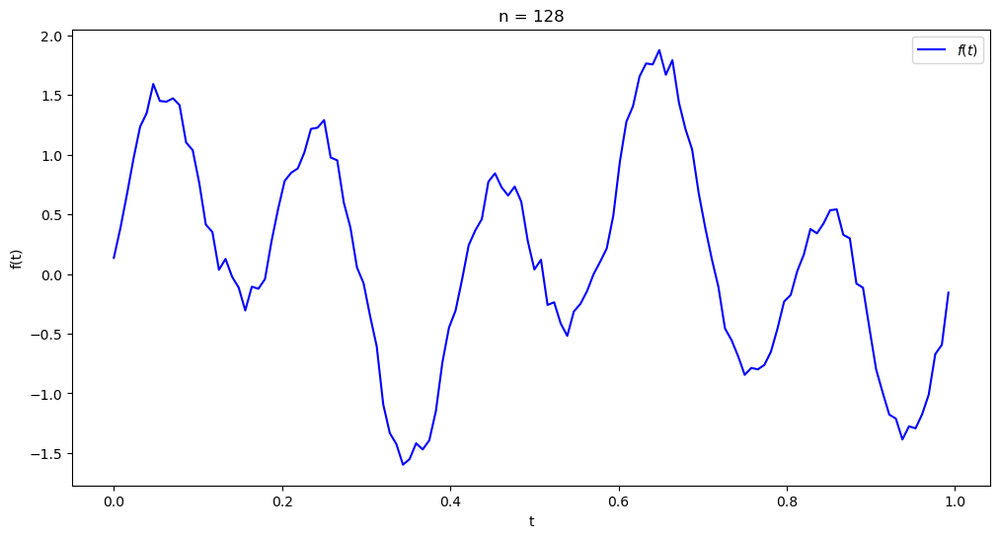

<div style='font-size: 3em; color: blue;' align='center'><b>Lab06_Report</b></div>


<div align='center'>申长硕 大数据学院 PB22020518</div>


<div style='font-size: 2em; color: purple;' align='center'><b>问题引入</b></div>

### 背景

对于提高图像的分辨率或降低图像的噪声，FFT(Fast Fourier Transformation)是一种常见的方法。通过FFT将灰度像素模式的图像信息转换成频域信息，做进一步处理之后再通过逆变换将频域信息转换回图像信息。

### 实验目的

通过FFT于FFT_inv实现对给定函数的Fourier分析以及重建。

<div style='font-size: 2em; color: purple;' align='center'><b>数学分析</b></div>

### FFT实现图像处理过程

FFT实现提高分辨率或降噪的过程一般是：

1. 实现FFT，将灰度图像转换为频域
2. 零域部分的可视化与集中
3. 应用低/高同滤波器过滤频率
4. 离散
5. 实现FFT逆变换生成图像数据


### DFT与FFT

DFT是离散傅里叶变换，其计算可以直接表示为：
$$
\begin{bmatrix}
g_0 \\
g_1 \\
g_2 \\
\vdots \\
g_{n-1}
\end{bmatrix}

= \frac{1}{n}

\begin{bmatrix}
\rho^0 & \rho^0 & \rho^0 & \cdots & \rho^0 \\
\rho^0 & \rho^1 & \rho^2 & \cdots & \rho^{n-1} \\
\rho^0 & \rho^2 & \rho^4 & \cdots & \rho^{2(n-1)} \\
\vdots & \vdots & \vdots & \ddots & \vdots \\
\rho^0 & \rho^{n-1} & \rho^{2(n-1)} & \cdots & \rho^{(n-1)^2}
\end{bmatrix}

\begin{bmatrix}
f_0 \\
f_1 \\
f_2 \\
\vdots \
f_{n-1}
\end{bmatrix}
$$
其中$\rho = e^{-j \frac{2 \pi}{n}}$

其逆变换矩阵可表示为：
$$
F_n^{-1} = 
\begin{bmatrix} 
\rho^0 & \rho^0 & \rho^0 & \cdots & \rho^0  \\
\rho^0 & \rho^{-1} & \rho^{-2} & \cdots & \rho^{-(n-1)}  \\
\rho^0 & \rho^{-2} & \rho^{-4} & \cdots & \rho^{-2(n-1)}  \\
\vdots & \vdots & \vdots & \ddots & \vdots  \\
\rho^0 & rho^{-(n-1)} & \rho^{-2(n-1)} & \cdots & \rho^{-(n-1)^2} 
\end{bmatrix}
$$
快速傅立叶变换采用分而治之(Divide and conquer)策略。

逐次分半算法：若n=2^m为偶数，记 $ \omega_n = e^{-i 2\pi/n} $, 多项式 $ p(z) = \frac{1}{n} \sum_{k=0}^{n-1} f_k z^k $ ,则

$$
g_l = p(\omega_n^l), \quad l=0, 1, \cdots, n-1,
$$
即计算向量f的离散傅立叶变换等价于求多项式p(z)在n个点 $ \{1, \omega_n, \omega_n^2, \cdots, \omega_n^{n-1}\} $ 处的值。


将$p(x)$的系数按偶次项和奇数项分开，构造多项式

$$
p_0(z) = \frac{1}{m} \sum_{k=0}^{m-1} f_{2k} z^k, \quad p_1(z) = \frac{1}{m} \sum_{k=0}^{m-1} f_{2k+1} z^k,
$$

则

$$
p(z) = \frac{p_0(z^2) + z p_1(z^2)}{2}.
$$

问题转化为求$p_0(z)$和$p_1(z)$在$\{1, \omega_n^2, \omega_n^4, \cdots, \omega_n^{2(n-1)}\}$的值。

利用单位根的性质有

$$
\omega_n^{2k} = e^{-i \frac{2\pi}{n}  2k} = e^{-i \frac{2\pi}{m} k} = \omega_m^k, \quad k = 0, 1, \cdots, n-1,
$$

故前面的集合仅有$m$个不同的值，即$\{1, \omega_m, \omega_m^2, \cdots, \omega_m^{m-1}\}$.

对于$k = 0, 1, \cdots, m-1$，有

$$
g_k = p(\omega_n^k) = \frac{p_0(\omega_n^{2k}) + \omega_n^k p_1(\omega_n^{2k})}{2} = \frac{p_0(\omega_m^k) + \omega_n^k p_1(\omega_m^k)}{2},
$$

$$
g_{k+m} = p(\omega_n^{k+m}) = \frac{p_0(\omega_n^{2k+n}) + \omega_n^{k+m} p_1(\omega_n^{2k+n})}{2} = \frac{p_0(\omega_m^k) - \omega_n^k p_1(\omega_m^k)}{2}
$$


### FFT的实现过程

直接摆对应算法：

```
Algorithm FFT

n <- length[f]
if n == 1 then
return f
end if

ω_n <- e^(-i2π/n)
ω <- 1

f^0 <- (f_0, f_2, ..., f_(n-2))
f^1 <- (f_1, f_3, ..., f_(n-1))

g^0 <- FFT(f^0)
g^1 <- FFT(f^1)

for k <- 0 to n/2 - 1 do
g_k <- (g^0_k + ωg^1_k) / 2
g_(k+n/2) <- (g^0_k - ωg^1_k) / 2
ω <- ωω_n
end for

return g
```

```
Algorithm IFFT

n <- length[f]
if n == 1 then
return f
end if

ω_n <- e^(i2π/n)
ω <- 1

f^0 <- (f_0, f_2, ..., f_(n-2))
f^1 <- (f_1, f_3, ..., f_(n-1))

g^0 <- IFFT(f^0)
g^1 <- IFFT(f^1)

for k <- 0 to n/2 - 1 do
g_k <- g^0_k + ωg^1_k
g_(k+n/2) <- g^0_k - ωg^1_k
ω <- ωω_n
end for

return g
```


<div style='font-size: 2em; color: purple;' align='center'><b>算法设计及代码实现</b></div>


### 定义FFT_Visualization类

##### 实现fft和ifft方法

```python
def calc_fft(self):
    def fft(x):
        N = len(x)
        if N <= 1:
            return x
        # 分别计算偶数项和奇数项
        even = fft(x[::2])
        odd = fft(x[1::2])
        # 计算g_k
        T = [np.exp(-2j * np.pi * k / N) * odd[k] for k in range(N // 2)]
        return [(even[k] + T[k])/2 for k in range(N // 2)] + [(even[k] - T[k])/2 for k in range(N // 2)]

    self.F = fft(self.func_values)

def calc_ifft(self):
    def ifft(X):
        N = len(X)
        if N <= 1:
            return X
        # 分别计算偶数项和奇数项
        even = ifft(X[::2])
        odd = ifft(X[1::2])
        T = [np.exp(2j * np.pi * k / N) * odd[k] for k in range(N // 2)]
        return [(even[k] + T[k]) for k in range(N // 2)] + [(even[k] - T[k]) for k in range(N // 2)]

    if not self.F:
        self.calc_fft()

    self.iF = ifft(self.F)
```

##### 对应结果的可视化

###### fft

```python
def fft_plot(self):
    if self.F is None:
        self.calc_fft()

    print("G's sequence:")
    print([(np.real(num), np.imag(num)) for num in self.F])

    # 创建一个图像，只包含三维图像
    fig1 = plt.figure(figsize=(12, 12))
    ax1 = fig1.add_subplot(111, projection='3d')
    ax1.plot(range(len(self.F)), np.real(self.F), np.imag(self.F), label='Complex Sequence', color='green')
    ax1.plot(range(len(self.F)), np.real(self.F), np.zeros_like(self.F), label='Real Projection', color='blue')
    ax1.plot(range(len(self.F)), np.zeros_like(self.F), np.imag(self.F), label='Imaginary Projection', color='red')
    ax1.set_title('FFT of $f_1(t)$ (n = {}) - 3D Plot'.format(self.size))
    ax1.set_xlabel('Index')
    ax1.set_ylabel('Real Part')
    ax1.set_zlabel('Imaginary Part')
    ax1.legend()
    plt.show()

    # 再创建一个图像，只包含基本图像
    fig2 = plt.figure(figsize=(12, 9))

    plt.subplot(3, 1, 1)
    plt.plot(np.abs(self.F), label='Absolute', color='blue')
    plt.title('FFT of $f_1(t)$ (n = {}) - Real Part'.format(self.size))
    plt.xlabel('Index')
    plt.ylabel('Real Part')
    plt.legend()

    plt.subplot(3, 1, 2)
    plt.plot(np.real(self.F), label='Real', color='blue')
    plt.title('FFT of $f_1(t)$ (n = {}) - Real Part'.format(self.size))
    plt.xlabel('Index')
    plt.ylabel('Real Part')
    plt.legend()

    plt.subplot(3, 1, 3)
    plt.plot(np.imag(self.F), label='Imaginary', color='red')
    plt.title('FFT of $f_1(t)$ (n = {}) - Imaginary Part'.format(self.size))
    plt.xlabel('Index')
    plt.ylabel('Imaginary Part')
    plt.legend()

    plt.tight_layout()
    plt.show()
```

###### ifft

```python
def ifft_plot(self):
    if not self.iF:
        self.calc_ifft()

    # 绘制逆 FFT 结果的实部和虚部
    plt.figure(figsize=(12, 6))

    plt.subplot(2, 1, 1)
    plt.plot(np.real(self.iF), label='Real', color='blue')
    plt.title('IFFT of FFT of $f_1(t)$ (n = {}) - Real Part'.format(self.size))
    plt.xlabel('Index')
    plt.ylabel('Real Part')
    plt.legend()

    plt.subplot(2, 1, 2)
    plt.plot(np.imag(self.iF), label='Imaginary', color='red')
    plt.title('IFFT of FFT of $f_1(t)$ (n = {}) - Imaginary Part'.format(self.size))
    plt.xlabel('Index')
    plt.ylabel('Imaginary Part')
    plt.legend()

    plt.tight_layout()
    plt.show()
```

###### 误差

```python
def calc_error(self):
    '''计算逆 FFT 结果和原始函数之间的误差'''
    if not self.iF:
        print("Please perform inverse FFT first.")
        return

    func_values_ifft = np.real(self.iF)

    # 计算绝对误差
    self.absolute_errors = [abs((self.func_values[i] - func_values_ifft[i])) for i in range(self.size)]

def plot_errors(self, tolerance=1e-6):
    '''
    绘制误差随着索引的变化
    '''
    if not self.absolute_errors:
        self.calc_error()

    max_error = np.max(self.absolute_errors)
    print(f'max absolute error: {max_error}')
    if max_error < tolerance:
        print("Inverse FFT result is close to original function.")
    else:
        print("Inverse FFT result is not close to original function.")

    # 绘制误差图像
    plt.figure(figsize=(10, 6))
    plt.plot(range(self.size), self.absolute_errors, color='blue', label='Absolute Error')
    plt.axhline(y=tolerance, color='red', linestyle='--', label='Tolerance')
    plt.title('Errors of Inverse FFT Result')
    plt.xlabel('Index')
    plt.ylabel('Absolute Error')
    plt.legend()
    plt.grid(True)
    plt.show()
```

###### 低通滤波

```python
def low_pass_filter(self, ratio=0.25):
    """
    对频域信号进行低频滤波，保留前 ratio 比例的频率分量，其余置零。
    """
    if not self.F:
        self.calc_fft()

    num_freq_components = len(self.F)
    num_components_to_keep = int(ratio * num_freq_components)

    self.filtered_F = np.zeros_like(self.F)
    self.filtered_F[:num_components_to_keep] = self.F[:num_components_to_keep]

    # return filtered_F

def low_pass_filter_and_plot(self, ratio=0.25):
    """
    对频域信号进行低频滤波并绘制滤波后的结果。
    """
    self.low_pass_filter(ratio)

    # 绘制 FFT 结果的实部和虚部
    plt.figure(figsize=(12, 6))

    plt.subplot(2, 1, 1)
    plt.plot(np.real(self.filtered_F), label='Real', color='blue')
    plt.title('Filtered FFT of $f_1(t)$ (n = {}) - Real Part'.format(self.size))
    plt.xlabel('Index')
    plt.ylabel('Real Part')
    plt.legend()

    plt.subplot(2, 1, 2)
    plt.plot(np.imag(self.filtered_F), label='Imaginary', color='red')
    plt.title('Filtered FFT of $f_1(t)$ (n = {}) - Imaginary Part'.format(self.size))
    plt.xlabel('Index')
    plt.ylabel('Imaginary Part')
    plt.legend()

    plt.tight_layout()
    plt.show()

```

###### 低通后ifft

```python
def filter_ifft(self):
    """
    计算滤波后的逆 FFT。
    """
    if self.filtered_F is None:
        self.low_pass_filter()
        print("Please perform low-pass filtering first.")

    def ifft(X):
        N = len(X)
        if N <= 1:
            return X
        # 分别计算偶数项和奇数项
        even = ifft(X[::2])
        odd = ifft(X[1::2])
        T = [np.exp(2j * np.pi * k / N) * odd[k] for k in range(N // 2)]
        return [(even[k] + T[k]) for k in range(N // 2)] + [(even[k] - T[k]) for k in range(N // 2)]

    self.filtered_iF = ifft(self.filtered_F)

def plot_filtered_ifft(self):
    """
    绘制滤波后的逆 FFT 结果的实部和虚部。
    """
    if self.filtered_iF is None:
        self.filter_ifft()

    # 绘制逆 FFT 结果的实部和虚部
    plt.figure(figsize=(12, 6))

    plt.subplot(2, 1, 1)
    plt.plot(np.real(self.filtered_iF), label='Real', color='blue')
    plt.title('Filtered IFFT of Filtered FFT of $f_1(t)$ (n = {}) - Real Part'.format(self.size))
    plt.xlabel('Index')
    plt.ylabel('Real Part')
    plt.legend()

    plt.subplot(2, 1, 2)
    plt.plot(np.imag(self.filtered_iF), label='Imaginary', color='red')
    plt.title('Filtered IFFT of Filtered FFT of $f_1(t)$ (n = {}) - Imaginary Part'.format(self.size))
    plt.xlabel('Index')
    plt.ylabel('Imaginary Part')
    plt.legend()

    plt.tight_layout()
    plt.show()
```

<div style='font-size: 2em; color: purple;' align='center'><b>分析与思考</b></div>

### 输出结果

#### FFT的结果

四组计算出的结果：

由于数据实在太多，所以仅截屏打印，具体可见`run.ipynb`，主要实现下面的可视化，而且已经使用绝对误差进行验证最终结果是正确的


| 函数         | 函数图像                      | FFT总图像                       | 绝对值及各部分图像           |
| ------------ | ----------------------------- | ------------------------------- | ---------------------------- |
| $f_{1*n1}$   |  |  |  |
| $f_{1*n2}$   |  |  |  |
| $f_{2 * n1}$ |  |  |  |
| $f_{2 * n2}$ |  |  |  |

#### IFFT的结果

| 函数       | ifft结果                      | 误差                           | 绝对误差最大值        |
| ---------- | ----------------------------- | ------------------------------ | --------------------- |
| $f_{1*n1}$ |  |  | 2.220446049250313e-16 |
| $f_{1*n2}$ |  |  | 4.440892098500626e-16 |
| $f_{2*n1}$ |  |  | 2.220446049250313e-16 |
| $f_{2*n2}$ |  |  | 4.996003610813204e-16 |

#### 低通滤波

| 函数       | 低通fft                         | 低通ifft                         |
| ---------- | ------------------------------- | -------------------------------- |
| $f_{1*n1}$ |  |  |
| $f_{1*n2}$ |  |  |
| $f_{2*n1}$ |  |  |
| $f_{2*n2}$ |  |  |


<div style='font-size: 2em; color: purple;' align='center'><b>总结与分析</b></b></div>

### 分析总结

1. 本实验主要实现：
    1. FFT和IFFT的函数实现
    2. 快速傅里叶变换及反变换过程中的可视化
    3. 低通滤波正反傅里叶变换及其可视化
2. 经过观察：
    1. FFT是将时域上的信号反映到频域上，方便进行后续处理
    2. 反变换则与之相反
    3. 低通滤波就是直接按某比例将高频的幅频置为0
    4. 经过观察，低通之后的反傅里叶得到的结果相较原函数相对更加光滑
    5. 其实也就是留下低频的周期函数分量，去掉小周期的周期函数从而去掉“毛刺”
    6. 经过实际观察，使用低通滤波却是可以实现这样的效果
