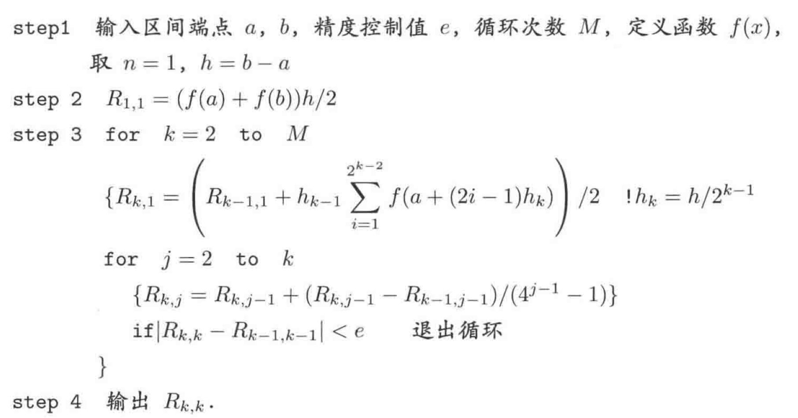
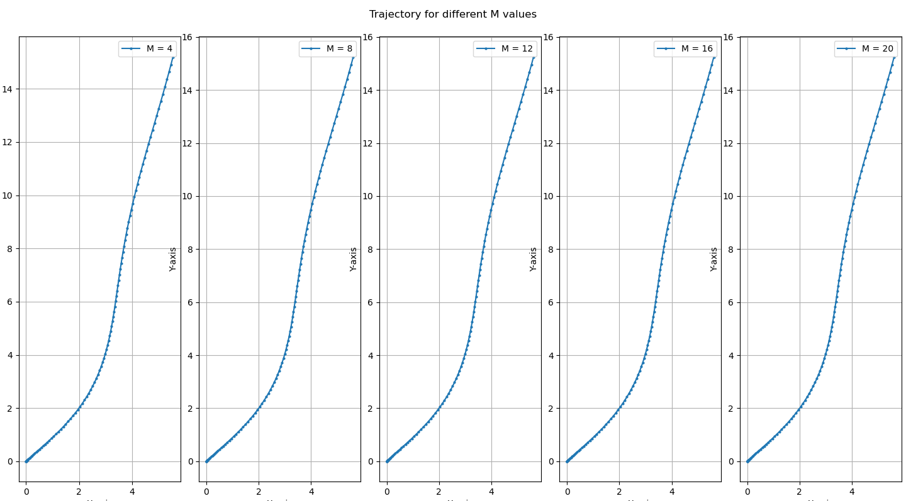

<div style='font-size: 3em; color: blue;' align='center'><b>Lab7_Report</b></div>

<div align='center'>申长硕 人工智能与数据科学学院 PB22020518</div>

<div style='font-size: 2em; color: purple;' align='center'><b>问题引入</b></div>

​	物理模拟在计算机图形学中起到非常重要的作用，其中数值积分的重要性不言而喻

​	考虑二维问题，质点初始时(t = 0)位于原点，速度为0收到水平和竖直两个力，获得两个独立的加速度$a_x(t), a_y(t)$，目标是计算其轨迹
$$
\begin{cases}
\begin{align}
v_x(t) &= \int_0^t a_x(s)ds\\
x(t) &= \int_0^tv_x(s)ds \\
&= \int_0^tds\int_0^s a_x(r)dr
\end{align}
\end{cases}
$$
​	现已有两个方向的加速度
$$
\begin{cases}
a_x(t) = \frac{sin(t)}{\sqrt{t} + 1}\\
a_y(t) = \frac{log(t + 1)}{t + 1}
\end{cases}
$$
​	使用`Romberg积分`作为数值积分方法，计算质点在时刻$ t \in linspace(0, 10, 100)$的位移$(x(t), y(t))$，其中初始区间数$M = 8$（M取4, 8, 12, 16， 20）做比较

<div style='font-size: 2em; color: purple;' align='center'><b>数学分析</b></div>

`Romberg积分`

从复化积分公式开始：

1. 复化梯形积分，第K个子区间上的积分公式：
    $$
    I_k = \int_{x_k}^{x_{k + 1}}f(x)dx = \frac{h}{2}[f(x_k) + f(x_{k + 1})]
    $$
    其截断误差
    $$
    R_1^N(f) = -\frac{b - a}{12}h^2f''(\eta)
    $$

2. 复化Simpson积分
    $$
    I_k = \int_{x_{2k}}^{x_{2k + 2}}f(x)dx = \frac{h}{6}[f(x_{2k}) + 4f(x_{2k + 1}) + f(x_{2k + 2})]
    $$
    其截断误差
    $$
    R_2^N(f) = -\frac{b - a}{2880}h^4f^{(4)}(\eta)
    $$

3. 复化Cotes积分、、、

直接开始讨论Romberg公式
1. 使用梯形公式可以组合成Simpson积分：
	$$
	I(f) \approx T_{2n}(f) + \frac{1}{3}(T_{2n}(f) - T_n(f)) = \frac{4}{3}T_{2n} - \frac{1}{3}T_n = S_n
	$$
	
2. 再通过对Simpson积分进行组合得到Cotes积分
   $$
	I(f) \approx S_{2n}(f) + \frac{1}{15}(S_{2n}(f) - S_n{f}) = C_n(f)
   $$

3. 类似的，通过对Cotes积分做组合得到Romberg积分
	$$
	R_n(f) = C_{2n}(f) + \frac{1}{63}(C_{2n}(f) - C_n(f))
	$$
   
   还可以继续做下去
   
4. 于是，我们可以得到一个递推公式：
	$$
	R_{k, j} = R_{k, j - 1} + \frac{R_{k, j - 1} - R_{k-1, j-1}}{4^{j - 1} - 1}, ~f = 2, 3, ...
	$$
   
5. 给出Romberg算法的伪代码 

<div style='font-size: 2em; color: purple;' align='center'><b>算法设计及代码实现</b></div>
本实验使用Cpp完成计算部分，使用python实现可视化部分

主要是Cpp实现Romberg的函数
```
double Romberg(double a, double b, double e, int M, std::function<double(double)> f, int &hit_count, int &total_count) {
    std::vector<std::vector<double>> R(M, std::vector<double>(M, 0.0));
    R[0][0] = (f(a) + f(b)) * (b - a) / 2;
    auto h = [a, b](int x) { return (b - a) / std::pow(2, x - 1); };
    // 每次进入循环，记录总调用次数
    total_count++;
    int result_index = 0;
    for (int k = 1; k < M; k++) 
    {
        result_index = k;
        double sum = 0.0;
        for (int i = 1; i <= std::pow(2, k - 1); i++) {
            sum += f(a + (2 * i - 1) * h(k + 1));
        }
        R[k][0] = (R[k - 1][0] + h(k) * sum) / 2;

        for (int j = 1; j <= k; j++) {
            R[k][j] = R[k][j - 1] + (R[k][j - 1] - R[k - 1][j - 1]) / (std::pow(4, j) - 1);
        }

        if (std::abs(R[k][k] - R[k - 1][k - 1]) < e) {
            hit_count++;
            break;
        }
    }

    return R[result_index][result_index];
}
```
其余函数不再展示，详间src中`run.cpp`和`run.py`
最终的console段输出结果

```
M = 4, 达到误差要求的比例: 15.8954%
M = 8, 达到误差要求的比例: 65.0738%
M = 12, 达到误差要求的比例: 100%
M = 16, 达到误差要求的比例: 100%
M = 20, 达到误差要求的比例: 100%
```
可视化结果

<div style='font-size: 2em; color: purple;' align='center'><b>分析与思考</b></div>

* 经过观察，在M较小时，随着M的增大，`Romberg`达到要求精度的比例会随之提升，不过到了某个$M_0$之后就达到100了，之后也就不再需要提高M了，不过其实根据我们所说的已经控制在要求精度内，也就不会再迭代下去了
* 本次实验需要进行两次`Rombeg`积分，中间嵌套的一次感觉有些难压
* 关于选取一个合适的M，个人觉得稳妥的方式还是递归，然后分析过去几次的达到误差要求的比例是否一定程度上不再变化，如果“收敛”，就达到了一个合适的M值，不需要再增加M了